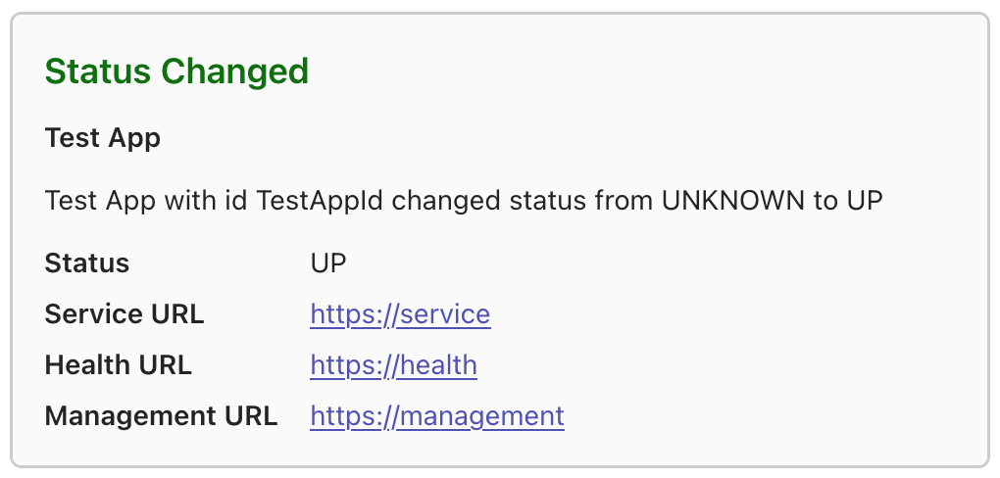

---
sidebar_custom_props:
  icon: 'notifications'
---
import metadata from "@sba/spring-boot-admin-server/target/classes/META-INF/spring-configuration-metadata.json";
import { PropertyTable } from "@sba/spring-boot-admin-docs/src/site/src/components/PropertyTable";

# Microsoft Teams Notifications

To enable Microsoft Teams notifications, you need to set up a connector webhook url and set the appropriate configuration property.

<figure>
  
  <figcaption>Sample Microsoft Teams notification for a `STATUS_CHANGED` event</figcaption>
</figure>

## Message format

Notifications are sent as [Adaptive Cards](https://adaptivecards.microsoft.com/). The card body is composed of the title, the instance name, the text and a `FactSet` containing the instance's status and URLs.

## SpEL expression context

The expression-based properties are parsed as SpEL template expressions (`#{ ... }`). The following root variables are available:

| Variable | Type | Description |
| --- | --- | --- |
| `event` | [`InstanceEvent`](https://github.com/codecentric/spring-boot-admin/blob/master/spring-boot-admin-server/src/main/java/de/codecentric/boot/admin/server/domain/events/InstanceEvent.java) | The event that triggered the notification. Frequently used property: `type` (one of `REGISTERED`, `DEREGISTERED`, `STATUS_CHANGED`, `REGISTRATION_UPDATED`, `INFO_CHANGED`, `ENDPOINTS_DETECTED`). For `STATUS_CHANGED` events `event.statusInfo.status` holds the new status. |
| `instance` | [`Instance`](https://github.com/codecentric/spring-boot-admin/blob/master/spring-boot-admin-server/src/main/java/de/codecentric/boot/admin/server/domain/entities/Instance.java) | The full instance aggregate. Frequently used paths: `instance.id` (e.g. "TestAppId"), `instance.registration.name` (e.g. "Test App"), `instance.statusInfo.status` (one of `UP`, `DOWN`, `OFFLINE`, `RESTRICTED`, `OUT_OF_SERVICE`, `UNKNOWN`). |
| `lastStatus` | `String` | The previous status code of the instance (e.g. `UP`, `DOWN`, `UNKNOWN`), useful for building messages like `from #{lastStatus} to #{event.statusInfo.status}`. |

<PropertyTable
  title="Microsoft Teams notifications configuration options"
  properties={metadata.properties}
  filter={['notify.ms-teams']}
  includeOnly={true}
/>
