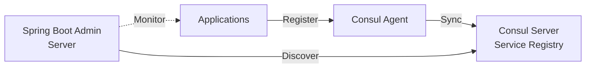

# Consul Integration

HashiCorp Consul is a service mesh solution that provides service discovery, health checking, and key-value storage.
This guide shows how to integrate Spring Boot Admin with Consul.

## Overview

With Consul integration:

- Applications register with Consul
- Spring Boot Admin Server discovers applications via Consul
- Built-in health checks
- No Spring Boot Admin Client library required

## Architecture



## Setting Up Consul

### Install Consul

```bash
# macOS
brew install consul

# Linux
wget https://releases.hashicorp.com/consul/1.17.0/consul_1.17.0_linux_amd64.zip
unzip consul_1.17.0_linux_amd64.zip
sudo mv consul /usr/local/bin/

# Docker
docker run -d --name=consul -p 8500:8500 consul:latest
```

### Start Consul

```bash
# Development mode
consul agent -dev

# Production mode
consul agent -server -bootstrap-expect=1 -data-dir=/tmp/consul
```

Access Consul UI at: `http://localhost:8500`

## Configuring Spring Boot Admin Server

### Add Dependencies

```xml title="pom.xml"
<dependencies>
    <dependency>
        <groupId>de.codecentric</groupId>
        <artifactId>spring-boot-admin-starter-server</artifactId>
    </dependency>
    <dependency>
        <groupId>org.springframework.boot</groupId>
        <artifactId>spring-boot-starter-webflux</artifactId>
    </dependency>
    <dependency>
        <groupId>org.springframework.cloud</groupId>
        <artifactId>spring-cloud-starter-consul-discovery</artifactId>
    </dependency>
</dependencies>
```

### Enable Discovery

```java title="SpringBootAdminConsulApplication.java"
import de.codecentric.boot.admin.server.config.EnableAdminServer;
import org.springframework.boot.SpringApplication;
import org.springframework.boot.autoconfigure.SpringBootApplication;
import org.springframework.cloud.client.discovery.EnableDiscoveryClient;

@EnableDiscoveryClient
@EnableAdminServer
@SpringBootApplication
public class SpringBootAdminConsulApplication {
    public static void main(String[] args) {
        SpringApplication.run(SpringBootAdminConsulApplication.class, args);
    }
}
```

### Configure Consul Client

```yaml title="application.yml"
spring:
  application:
    name: spring-boot-admin-server
  cloud:
    consul:
      host: localhost
      port: 8500
      discovery:
        preferIpAddress: true
        health-check-interval: 10s
        health-check-path: /actuator/health
        instance-id: ${spring.application.name}:${random.value}

management:
  endpoints:
    web:
      exposure:
        include: "*"
  endpoint:
    health:
      show-details: ALWAYS
```

### Ignore Consul Service

Don't monitor Consul itself:

```yaml title="application.yml"
spring:
  boot:
    admin:
      discovery:
        ignored-services: consul
```

## Configuring Client Applications

### Add Dependencies

```xml title="pom.xml"
<dependency>
    <groupId>org.springframework.cloud</groupId>
    <artifactId>spring-cloud-starter-consul-discovery</artifactId>
</dependency>
```

### Enable Discovery

```java
@EnableDiscoveryClient
@SpringBootApplication
public class Application {
    public static void main(String[] args) {
        SpringApplication.run(Application.class, args);
    }
}
```

### Configure Application

```yaml title="application.yml"
spring:
  application:
    name: my-application
  cloud:
    consul:
      host: localhost
      port: 8500
      discovery:
        metadata:
          management-context-path: ${management.server.base-path:/actuator}
          health-path: ${management.endpoints.web.path-mapping.health:health}

management:
  endpoints:
    web:
      exposure:
        include: "*"
      base-path: /actuator
  endpoint:
    health:
      show-details: ALWAYS
```

## Metadata in Consul

### Important: No Dots in Keys

:::warning
Consul **does not allow dots (`.`)** in metadata keys. Use dashes (`-`) or underscores (`_`) instead.
:::

**Wrong**:

```yaml
metadata:
  user.name: admin       # ❌ Won't work
  user.password: secret  # ❌ Won't work
```

**Correct**:

```yaml
metadata:
  user-name: admin       # ✅ Works
  user-password: secret  # ✅ Works
```

### Adding Custom Metadata

```yaml title="application.yml"
spring:
  cloud:
    consul:
      discovery:
        metadata:
          management-context-path: /actuator
          health-path: /ping
          user-name: ${spring.security.user.name}
          user-password: ${spring.security.user.password}
          tags-environment: production
          tags-region: us-east-1
          team: platform
```

### Tags

Consul supports tags for grouping:

```yaml title="application.yml"
spring:
  cloud:
    consul:
      discovery:
        tags:
          - production
          - us-east-1
          - platform-team
```

## Custom Management Configuration

### Different Management Port

```yaml title="application.yml"
server:
  port: 8080

management:
  server:
    port: 9090
  endpoints:
    web:
      base-path: /management

spring:
  cloud:
    consul:
      discovery:
        metadata:
          management-port: 9090
          management-context-path: /management
```

### Custom Health Check Path

```yaml title="application.yml"
management:
  endpoints:
    web:
      path-mapping:
        health: /ping
      base-path: /actuator

spring:
  cloud:
    consul:
      discovery:
        health-check-path: /actuator/ping
        metadata:
          health-path: /ping
```

## Health Checks

### Default Health Check

Consul automatically creates HTTP health check:

```yaml
spring:
  cloud:
    consul:
      discovery:
        health-check-interval: 10s
        health-check-timeout: 5s
        health-check-path: /actuator/health
```

### Custom Health Check

```yaml
spring:
  cloud:
    consul:
      discovery:
        health-check-url: https://my-app.example.com/actuator/health
        health-check-interval: 15s
        health-check-critical-timeout: 30s
```

### TTL Health Check

Use TTL-based health check instead of HTTP:

```yaml
spring:
  cloud:
    consul:
      discovery:
        health-check-interval: 10s
        heartbeat:
          enabled: true
          ttl-value: 15
          ttl-unit: s
```

## Service Filtering

### By Service Name

```yaml title="application.yml (Admin Server)"
spring:
  boot:
    admin:
      discovery:
        ignored-services: consul,config-server
```

### By Metadata

```java
@Bean
public InstanceFilter consulInstanceFilter() {
    return registration -> {
        // Only monitor services with 'monitor' tag
        Map<String, String> metadata = registration.getMetadata();
        return "true".equals(metadata.get("monitor"));
    };
}
```

### By Tags

```java
@Bean
public InstanceFilter tagBasedFilter() {
    return registration -> {
        String tags = registration.getMetadata().get("tags");
        return tags != null && tags.contains("production");
    };
}
```

## Securing Consul

### ACL Token

```yaml title="application.yml"
spring:
  cloud:
    consul:
      host: localhost
      port: 8500
      discovery:
        acl-token: ${CONSUL_ACL_TOKEN}
```

### TLS/SSL

```yaml title="application.yml"
spring:
  cloud:
    consul:
      host: localhost
      port: 8501
      scheme: https
      tls:
        enabled: true
        cert-path: /path/to/cert.pem
        key-path: /path/to/key.pem
        ca-cert-path: /path/to/ca.pem
```

## Docker Compose Example

```yaml title="docker-compose.yml"
version: '3'

services:
  consul:
    image: consul:latest
    ports:
      - "8500:8500"
      - "8600:8600/udp"
    command: agent -server -ui -bootstrap-expect=1 -client=0.0.0.0

  spring-boot-admin:
    build: ./admin-server
    ports:
      - "8080:8080"
    environment:
      - SPRING_CLOUD_CONSUL_HOST=consul
    depends_on:
      - consul

  my-application:
    build: ./my-app
    ports:
      - "8081:8081"
    environment:
      - SPRING_CLOUD_CONSUL_HOST=consul
    depends_on:
      - consul
```

## Kubernetes Integration

For Kubernetes, use Consul Connect:

```yaml title="application.yml"
spring:
  cloud:
    consul:
      host: consul.service.consul
      port: 8500
      discovery:
        preferIpAddress: false
        hostname: ${HOSTNAME}.my-app.default.svc.cluster.local
        metadata:
          k8s-namespace: ${POD_NAMESPACE:default}
          k8s-pod: ${HOSTNAME}
```

## Troubleshooting

### Service Not Appearing

1. **Check Consul registration**:
   ```bash
   curl http://localhost:8500/v1/catalog/services
   curl http://localhost:8500/v1/health/service/my-application
   ```

2. **Verify health check**:
   ```bash
   consul catalog services
   consul catalog nodes -service=my-application
   ```

3. **Check metadata**:
   ```bash
   curl http://localhost:8500/v1/catalog/service/my-application | jq
   ```

### Metadata Not Working

Ensure no dots in keys:

```yaml
# Wrong
metadata:
  user.name: admin

# Correct
metadata:
  user-name: admin
```

### Health Check Failing

Verify endpoint is accessible:

```bash
curl http://localhost:8081/actuator/health
```

Check Consul health status:

```bash
consul catalog nodes -service=my-application -detailed
```

### Deregistration Issues

Configure critical timeout:

```yaml
spring:
  cloud:
    consul:
      discovery:
        health-check-critical-timeout: 30s
```

## Best Practices

1. **Use Instance IDs**: Ensure unique instance identifiers
   ```yaml
   spring:
     cloud:
       consul:
         discovery:
           instance-id: ${spring.application.name}:${random.value}
   ```

2. **Configure Health Checks**: Set appropriate intervals
   ```yaml
   spring:
     cloud:
       consul:
         discovery:
           health-check-interval: 10s
           health-check-critical-timeout: 1m
   ```

3. **Use Metadata for Credentials**: Avoid hardcoding
   ```yaml
   spring:
     cloud:
       consul:
         discovery:
           metadata:
             user-name: ${ACTUATOR_USER}
             user-password: ${ACTUATOR_PASSWORD}
   ```

4. **Prefer IP Address**: For container environments
   ```yaml
   spring:
     cloud:
       consul:
         discovery:
           preferIpAddress: true
   ```

5. **Use Tags**: For service categorization
   ```yaml
   spring:
     cloud:
       consul:
         discovery:
           tags:
             - production
             - microservice
   ```

6. **Enable Deregistration**: Clean up on shutdown
   ```yaml
   spring:
     cloud:
       consul:
         discovery:
           deregister: true
   ```

7. **Monitor Consul Health**: Ensure Consul is operational
   ```bash
   consul members
   consul info
   ```

## Complete Example

See
the [spring-boot-admin-sample-consul](https://github.com/codecentric/spring-boot-admin/tree/master/spring-boot-admin-samples/spring-boot-admin-sample-consul/)
project for a complete working example.

## See Also

- [Service Discovery](../03-client/40-service-discovery.md) - Service discovery overview
- [Consul Sample](../09-samples/40-sample-consul.md) - Detailed sample walkthrough
- [Metadata](../03-client/30-metadata.md) - Working with metadata
- [Security](../02-server/02-security.md) - Securing discovered services
