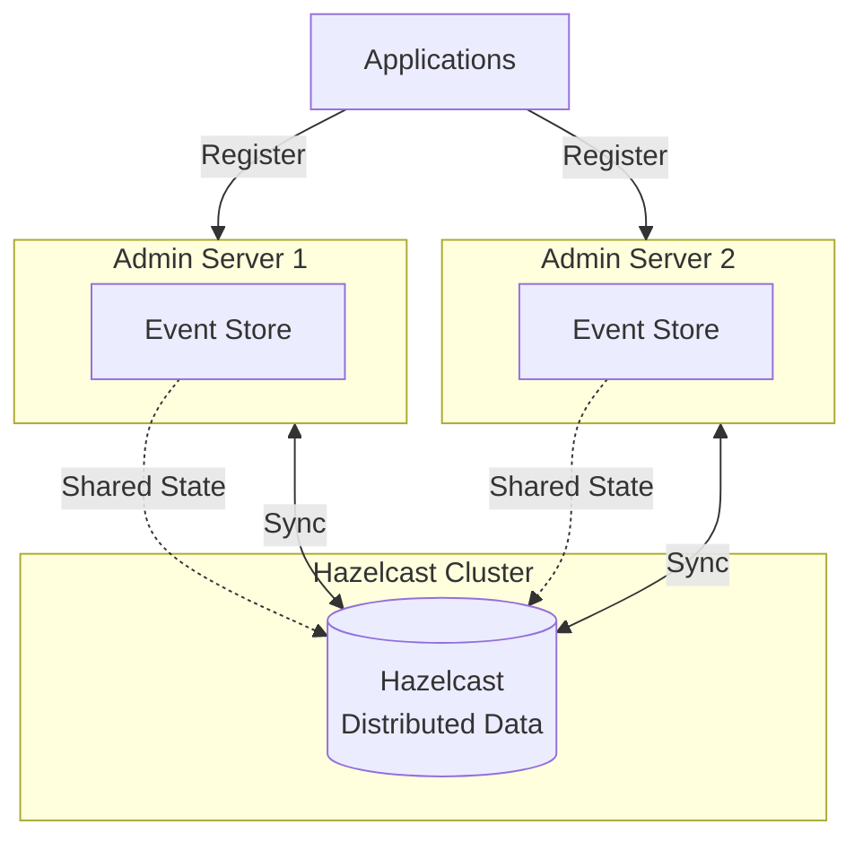

# Hazelcast Clustering

Hazelcast provides distributed data structures for clustering multiple Spring Boot Admin Server instances. This enables
high availability and shared state across servers.

## Overview

With Hazelcast clustering:

- Multiple Admin Server instances share event store
- No single point of failure
- Automatic synchronization across nodes
- Distributed notifications

## Architecture



## Why Hazelcast?

- **High Availability**: No single point of failure
- **Scalability**: Add more Admin Server instances
- **Shared State**: All servers see the same application state
- **Distributed Events**: Events propagated across cluster
- **Simple Setup**: Minimal configuration required

## Setting Up Hazelcast

### Add Dependencies

```xml title="pom.xml"
<dependencies>
    <dependency>
        <groupId>de.codecentric</groupId>
        <artifactId>spring-boot-admin-starter-server</artifactId>
    </dependency>
    <dependency>
        <groupId>org.springframework.boot</groupId>
        <artifactId>spring-boot-starter-webflux</artifactId>
    </dependency>
    <dependency>
        <groupId>com.hazelcast</groupId>
        <artifactId>hazelcast</artifactId>
    </dependency>
</dependencies>
```

### Configure Hazelcast

```java title="HazelcastConfig.java"
import com.hazelcast.config.Config;
import com.hazelcast.config.MapConfig;
import com.hazelcast.config.MergePolicyConfig;
import com.hazelcast.core.Hazelcast;
import com.hazelcast.core.HazelcastInstance;
import com.hazelcast.map.IMap;
import com.hazelcast.spi.merge.PutIfAbsentMergePolicy;
import de.codecentric.boot.admin.server.domain.events.InstanceEvent;
import de.codecentric.boot.admin.server.domain.values.InstanceId;
import de.codecentric.boot.admin.server.eventstore.HazelcastEventStore;
import de.codecentric.boot.admin.server.eventstore.InstanceEventStore;
import org.springframework.context.annotation.Bean;
import org.springframework.context.annotation.Configuration;

import java.util.List;

@Configuration
public class HazelcastConfig {

    @Bean
    public Config hazelcastConfig() {
        MapConfig mapConfig = new MapConfig("spring-boot-admin-event-store")
            .setBackupCount(1)
            .setMergePolicyConfig(new MergePolicyConfig(
                PutIfAbsentMergePolicy.class.getName(), 100));

        Config config = new Config();
        config.addMapConfig(mapConfig);
        config.setProperty("hazelcast.jmx", "true");

        // Network configuration
        config.getNetworkConfig()
            .setPort(5701)
            .setPortAutoIncrement(true)
            .getJoin()
            .getMulticastConfig()
            .setEnabled(true);

        return config;
    }

    @Bean
    public HazelcastInstance hazelcastInstance(Config hazelcastConfig) {
        return Hazelcast.newHazelcastInstance(hazelcastConfig);
    }

    @Bean
    public InstanceEventStore eventStore(HazelcastInstance hazelcastInstance) {
        IMap<InstanceId, List<InstanceEvent>> map =
            hazelcastInstance.getMap("spring-boot-admin-event-store");
        return new HazelcastEventStore(100, map);
    }
}
```

### Basic Configuration

```yaml title="application.yml"
spring:
  application:
    name: spring-boot-admin-server

hazelcast:
  network:
    port: 5701
    port-auto-increment: true
    join:
      multicast:
        enabled: true
      tcp-ip:
        enabled: false
```

## Network Configuration

### Multicast (Development)

Automatic discovery using multicast:

```java
config.getNetworkConfig()
    .getJoin()
    .getMulticastConfig()
    .setEnabled(true)
    .setMulticastGroup("224.2.2.3")
    .setMulticastPort(54327);
```

```yaml
hazelcast:
  network:
    join:
      multicast:
        enabled: true
        multicast-group: 224.2.2.3
        multicast-port: 54327
```

### TCP/IP (Production)

Explicit member list for production:

```java
config.getNetworkConfig()
    .getJoin()
    .getMulticastConfig()
    .setEnabled(false);

config.getNetworkConfig()
    .getJoin()
    .getTcpIpConfig()
    .setEnabled(true)
    .addMember("192.168.1.100")
    .addMember("192.168.1.101")
    .addMember("192.168.1.102");
```

```yaml
hazelcast:
  network:
    join:
      multicast:
        enabled: false
      tcp-ip:
        enabled: true
        members:
          - 192.168.1.100
          - 192.168.1.101
          - 192.168.1.102
```

### Kubernetes

For Kubernetes deployments:

```xml
<dependency>
    <groupId>com.hazelcast</groupId>
    <artifactId>hazelcast-kubernetes</artifactId>
</dependency>
```

```java
config.getNetworkConfig()
    .getJoin()
    .getMulticastConfig()
    .setEnabled(false);

config.getNetworkConfig()
    .getJoin()
    .getKubernetesConfig()
    .setEnabled(true)
    .setProperty("namespace", "default")
    .setProperty("service-name", "spring-boot-admin");
```

## Event Store Configuration

### Map Configuration

```java
MapConfig mapConfig = new MapConfig("spring-boot-admin-event-store")
    .setBackupCount(1)  // Number of backup copies
    .setAsyncBackupCount(0)  // Async backups
    .setTimeToLiveSeconds(0)  // No expiration
    .setMaxIdleSeconds(0)  // No idle timeout
    .setMergePolicyConfig(new MergePolicyConfig(
        PutIfAbsentMergePolicy.class.getName(), 100));
```

### Event Store Size

Limit events per instance:

```java
@Bean
public InstanceEventStore eventStore(HazelcastInstance hazelcastInstance) {
    IMap<InstanceId, List<InstanceEvent>> map =
        hazelcastInstance.getMap("spring-boot-admin-event-store");
    return new HazelcastEventStore(500, map);  // Max 500 events per instance
}
```

## High Availability Setup

### Load Balancer Configuration

```nginx
upstream spring_boot_admin {
    least_conn;
    server admin1:8080;
    server admin2:8080;
    server admin3:8080;
}

server {
    listen 80;
    server_name admin.example.com;

    location / {
        proxy_pass http://spring_boot_admin;
        proxy_set_header Host $host;
        proxy_set_header X-Real-IP $remote_addr;
        proxy_set_header X-Forwarded-For $proxy_add_x_forwarded_for;
        proxy_set_header X-Forwarded-Proto $scheme;
    }
}
```

### Session Persistence

Use sticky sessions for the UI:

```nginx
upstream spring_boot_admin {
    ip_hash;  # Sticky sessions
    server admin1:8080;
    server admin2:8080;
}
```

Or use Spring Session:

```xml
<dependency>
    <groupId>org.springframework.session</groupId>
    <artifactId>spring-session-hazelcast</artifactId>
</dependency>
```

```java
@EnableHazelcastHttpSession
@Configuration
public class SessionConfig {
    // Hazelcast will be used for session storage
}
```

## Docker Compose Example

```yaml title="docker-compose.yml"
version: '3'

services:
  admin1:
    build: ./admin-server
    ports:
      - "8080:8080"
    environment:
      - HAZELCAST_MEMBERS=admin1,admin2,admin3
      - SERVER_PORT=8080

  admin2:
    build: ./admin-server
    ports:
      - "8081:8080"
    environment:
      - HAZELCAST_MEMBERS=admin1,admin2,admin3
      - SERVER_PORT=8080

  admin3:
    build: ./admin-server
    ports:
      - "8082:8080"
    environment:
      - HAZELCAST_MEMBERS=admin1,admin2,admin3
      - SERVER_PORT=8080

  nginx:
    image: nginx:alpine
    ports:
      - "80:80"
    volumes:
      - ./nginx.conf:/etc/nginx/nginx.conf
    depends_on:
      - admin1
      - admin2
      - admin3
```

## Monitoring Hazelcast

### Management Center

Use Hazelcast Management Center:

```yaml
hazelcast:
  management-center:
    enabled: true
    url: http://localhost:8083/mancenter
```

### JMX Monitoring

Enable JMX:

```java
config.setProperty("hazelcast.jmx", "true");
```

### Health Checks

Check cluster health:

```java
@Component
public class HazelcastHealthCheck {

    private final HazelcastInstance hazelcastInstance;

    public HazelcastHealthCheck(HazelcastInstance hazelcastInstance) {
        this.hazelcastInstance = hazelcastInstance;
    }

    public boolean isHealthy() {
        return hazelcastInstance.getCluster().getMembers().size() > 0;
    }

    public int getClusterSize() {
        return hazelcastInstance.getCluster().getMembers().size();
    }
}
```

## Troubleshooting

### Split Brain

Configure merge policy:

```java
mapConfig.setMergePolicyConfig(new MergePolicyConfig(
    PutIfAbsentMergePolicy.class.getName(), 100));
```

### Members Not Joining

1. **Check network connectivity**:
   ```bash
   telnet admin1 5701
   ```

2. **Verify multicast**:
   ```bash
   # Check if multicast is enabled
   ip maddr show
   ```

3. **Check logs**:
   ```
   Hazelcast logs will show connection attempts
   ```

### Performance Issues

1. **Increase backup count**:
   ```java
   mapConfig.setBackupCount(2);
   ```

2. **Use async backups**:
   ```java
   mapConfig.setAsyncBackupCount(1);
   ```

3. **Monitor map size**:
   ```java
   IMap map = hazelcastInstance.getMap("spring-boot-admin-event-store");
   log.info("Map size: {}", map.size());
   ```

## Best Practices

1. **Use TCP/IP in Production**: Multicast may not work in cloud environments

2. **Configure Appropriate Backups**:
   ```java
   mapConfig.setBackupCount(1);  // At least 1 backup
   ```

3. **Set Event Store Limits**:
   ```java
   new HazelcastEventStore(500, map);  // Reasonable limit
   ```

4. **Monitor Cluster Health**: Use Management Center or JMX

5. **Use Load Balancer**: Distribute traffic across servers

6. **Enable Session Persistence**: For seamless failover

7. **Configure Network Properly**: Especially in Kubernetes/Docker

## Complete Example

See
the [spring-boot-admin-sample-hazelcast](https://github.com/codecentric/spring-boot-admin/tree/master/spring-boot-admin-samples/spring-boot-admin-sample-hazelcast/)
project for a complete working example.

## See Also

- [Clustering](../02-server/20-Clustering.mdx) - Clustering overview
- [Persistence](../02-server/30-persistence.md) - Event store details
- [Hazelcast Sample](../09-samples/60-sample-hazelcast.md) - Detailed sample walkthrough
