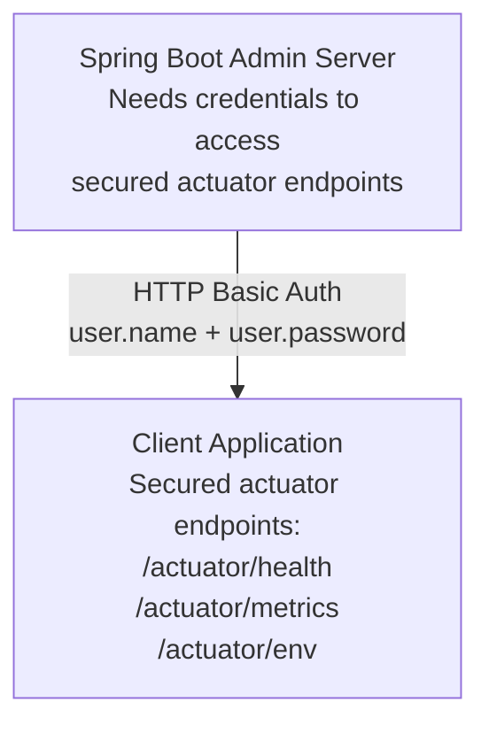

# Actuator Security

Secure your client application's actuator endpoints and configure Spring Boot Admin Server to access them.

## Overview

When client applications expose actuator endpoints, they should be secured. The Admin Server needs credentials to access
these secured endpoints.



---

## Quick Start

### 1. Client: Secure Actuator Endpoints

Add Spring Security to your client application:

**Maven**:

```xml
<dependency>
    <groupId>org.springframework.boot</groupId>
    <artifactId>spring-boot-starter-security</artifactId>
</dependency>
```

**Gradle**:

```gradle
implementation 'org.springframework.boot:spring-boot-starter-security'
```

**application.yml**:

```yaml
spring:
  security:
    user:
      name: actuator
      password: ${ACTUATOR_PASSWORD}

management:
  endpoints:
    web:
      exposure:
        include: "*"
```

### 2. Client: Share Credentials with Admin Server

Pass credentials via metadata:

```yaml
spring:
  boot:
    admin:
      client:
        url: http://admin-server:8080
        instance:
          metadata:
            user.name: actuator
            user.password: ${ACTUATOR_PASSWORD}
```

### 3. Server: Enable Instance Authentication

**application.yml**:

```yaml
spring:
  boot:
    admin:
      instance-auth:
        enabled: true
```

The Admin Server will automatically use credentials from instance metadata to access actuator endpoints.

---

## Client Configuration

### Basic Actuator Security

Simplest approach using default Spring Security user:

```yaml
spring:
  application:
    name: my-service

  security:
    user:
      name: actuator
      password: ${ACTUATOR_PASSWORD}

  boot:
    admin:
      client:
        url: http://admin-server:8080
        instance:
          metadata:
            user.name: ${spring.security.user.name}
            user.password: ${spring.security.user.password}

management:
  endpoints:
    web:
      exposure:
        include: health,info,metrics,env,loggers
```

### Custom Security Configuration

For more control, create a custom `SecurityFilterChain`:

```java
package com.example.myservice;

import org.springframework.boot.actuate.autoconfigure.security.servlet.EndpointRequest;
import org.springframework.context.annotation.Bean;
import org.springframework.context.annotation.Configuration;
import org.springframework.security.config.Customizer;
import org.springframework.security.config.annotation.web.builders.HttpSecurity;
import org.springframework.security.core.userdetails.User;
import org.springframework.security.core.userdetails.UserDetails;
import org.springframework.security.crypto.bcrypt.BCryptPasswordEncoder;
import org.springframework.security.crypto.password.PasswordEncoder;
import org.springframework.security.provisioning.InMemoryUserDetailsManager;
import org.springframework.security.web.SecurityFilterChain;

@Configuration
public class ActuatorSecurityConfig {

    @Bean
    public SecurityFilterChain filterChain(HttpSecurity http) throws Exception {
        http
            .authorizeHttpRequests(auth -> auth
                // Permit health endpoint for load balancers
                .requestMatchers(EndpointRequest.to("health")).permitAll()
                // Secure all other actuator endpoints
                .requestMatchers(EndpointRequest.toAnyEndpoint()).authenticated()
                // Allow application endpoints
                .anyRequest().permitAll()
            )
            // Use HTTP Basic for actuator
            .httpBasic(Customizer.withDefaults())
            // Disable CSRF for stateless API
            .csrf(csrf -> csrf.disable());

        return http.build();
    }

    @Bean
    public InMemoryUserDetailsManager userDetailsService(PasswordEncoder encoder) {
        UserDetails actuator = User.builder()
            .username("actuator")
            .password(encoder.encode(System.getenv("ACTUATOR_PASSWORD")))
            .roles("ACTUATOR")
            .build();

        return new InMemoryUserDetailsManager(actuator);
    }

    @Bean
    public PasswordEncoder passwordEncoder() {
        return new BCryptPasswordEncoder();
    }
}
```

### Different Actuator and Application Security

Separate security for actuator and application:

```java
@Configuration
@Order(1)  // Higher precedence
public class ActuatorSecurityConfig {

    @Bean
    @Order(1)
    public SecurityFilterChain actuatorFilterChain(HttpSecurity http) throws Exception {
        http
            .securityMatcher(EndpointRequest.toAnyEndpoint())
            .authorizeHttpRequests(auth -> auth
                .requestMatchers(EndpointRequest.to("health")).permitAll()
                .anyRequest().hasRole("ACTUATOR")
            )
            .httpBasic(Customizer.withDefaults())
            .csrf(csrf -> csrf.disable());

        return http.build();
    }

    @Bean
    public InMemoryUserDetailsManager actuatorUserDetailsService(PasswordEncoder encoder) {
        UserDetails actuator = User.builder()
            .username("actuator")
            .password(encoder.encode(System.getenv("ACTUATOR_PASSWORD")))
            .roles("ACTUATOR")
            .build();

        return new InMemoryUserDetailsManager(actuator);
    }
}

@Configuration
@Order(2)  // Lower precedence
public class ApplicationSecurityConfig {

    @Bean
    @Order(2)
    public SecurityFilterChain applicationFilterChain(HttpSecurity http) throws Exception {
        http
            .authorizeHttpRequests(auth -> auth
                .requestMatchers("/api/public/**").permitAll()
                .anyRequest().authenticated()
            )
            .oauth2Login(Customizer.withDefaults());

        return http.build();
    }
}
```

### Actuator on Separate Port

Run actuator on a different port for isolation:

```yaml
management:
  server:
    port: 8081  # Separate management port
  endpoints:
    web:
      exposure:
        include: "*"

spring:
  security:
    user:
      name: actuator
      password: ${ACTUATOR_PASSWORD}

  boot:
    admin:
      client:
        instance:
          # Admin Server will auto-detect management port
          # Or specify explicitly:
          management-base-url: http://localhost:8081
          metadata:
            user.name: actuator
            user.password: ${ACTUATOR_PASSWORD}
```

**Security configuration**:

```java
@Configuration
public class SecurityConfig {

    @Bean
    public SecurityFilterChain filterChain(HttpSecurity http) throws Exception {
        http
            .authorizeHttpRequests(auth -> auth
                // No actuator endpoints on main port
                .anyRequest().permitAll()
            )
            .csrf(csrf -> csrf.disable());

        return http.build();
    }
}
```

On port 8081, actuator endpoints are secured with Spring Security's default security.

---

## Server Configuration

### Enable Instance Authentication

```yaml
spring:
  boot:
    admin:
      instance-auth:
        enabled: true
```

Admin Server will:

1. Check instance metadata for `user.name` and `user.password`
2. Use these credentials to access actuator endpoints via HTTP Basic

### Default Credentials

Set default credentials for all instances:

```yaml
spring:
  boot:
    admin:
      instance-auth:
        enabled: true
        default-user-name: actuator
        default-password: ${DEFAULT_ACTUATOR_PASSWORD}
```

Instances can override via metadata.

### Per-Service Credentials

Configure different credentials for each service:

```yaml
spring:
  boot:
    admin:
      instance-auth:
        enabled: true
        service-map:
          # Service name from spring.application.name
          my-service:
            user-name: my-service-actuator
            user-password: ${MY_SERVICE_PASSWORD}
          another-service:
            user-name: another-actuator
            user-password: ${ANOTHER_SERVICE_PASSWORD}

        # Fallback for services not in service-map
        default-user-name: default-actuator
        default-password: ${DEFAULT_PASSWORD}
```

**Client (my-service)**:

```yaml
spring:
  application:
    name: my-service

  security:
    user:
      name: my-service-actuator
      password: ${MY_SERVICE_PASSWORD}
```

---

## Credential Strategies

### Strategy 1: Metadata (Recommended)

**Client passes credentials in metadata**:

```yaml
spring:
  boot:
    admin:
      client:
        instance:
          metadata:
            user.name: actuator
            user.password: ${ACTUATOR_PASSWORD}
```

**Server uses metadata automatically**:

```yaml
spring:
  boot:
    admin:
      instance-auth:
        enabled: true
```

**Pros**:

- Client controls its own credentials
- Each instance can have unique credentials
- Server automatically picks up credentials

**Cons**:

- Credentials visible in instance metadata (sanitized by default)
- Requires client configuration

### Strategy 2: Server-Side Configuration

**Server has all credentials**:

```yaml
spring:
  boot:
    admin:
      instance-auth:
        enabled: true
        service-map:
          service-a:
            user-name: service-a-user
            user-password: ${SERVICE_A_PASSWORD}
```

**Client just secures actuator**:

```yaml
spring:
  security:
    user:
      name: service-a-user
      password: ${SERVICE_A_PASSWORD}
```

**Pros**:

- Centralized credential management
- Client configuration simpler

**Cons**:

- Server must know all client credentials
- Harder to scale with many services

### Strategy 3: Default Credentials

**All clients use same credentials**:

**Server**:

```yaml
spring:
  boot:
    admin:
      instance-auth:
        enabled: true
        default-user-name: actuator
        default-password: ${ACTUATOR_PASSWORD}
```

**All Clients**:

```yaml
spring:
  security:
    user:
      name: actuator
      password: ${ACTUATOR_PASSWORD}
```

**Pros**:

- Simplest to configure
- Uniform across all services

**Cons**:

- Single credentials compromise affects all services
- Less secure

---

## Limiting Exposed Endpoints

Only expose necessary endpoints:

```yaml
management:
  endpoints:
    web:
      exposure:
        include: health,info,metrics,env,loggers
```

Or exclude specific endpoints:

```yaml
management:
  endpoints:
    web:
      exposure:
        include: "*"
        exclude: heapdump,threaddump
```

**Health endpoint details**:

```yaml
management:
  endpoint:
    health:
      show-details: when-authorized
      roles: ACTUATOR
```

---

## Metadata Sanitization

By default, credentials in metadata are sanitized:

```yaml
spring:
  boot:
    admin:
      metadata-keys-to-sanitize:
        - ".*password$"
        - ".*secret$"
        - ".*key$"
        - ".*token$"
        - ".*credentials.*"
```

Metadata `user.password` will appear as `******` in responses, but the server still uses it internally.

---

## Service Discovery

When using service discovery (Eureka, Consul, etc.), credentials can be set via metadata:

**Eureka**:

```yaml
eureka:
  instance:
    metadata-map:
      user.name: actuator
      user.password: ${ACTUATOR_PASSWORD}
```

**Consul**:

```yaml
spring:
  cloud:
    consul:
      discovery:
        metadata:
          user.name: actuator
          user.password: ${ACTUATOR_PASSWORD}
```

**Kubernetes ConfigMap**:

```yaml
apiVersion: v1
kind: ConfigMap
metadata:
  name: my-service-config
data:
  application.yml: |
    spring:
      boot:
        admin:
          client:
            instance:
              metadata:
                user.name: actuator
                user.password: ${ACTUATOR_PASSWORD}
```

---

## TLS/SSL for Actuator

Use HTTPS for actuator endpoints:

```yaml
management:
  server:
    port: 8443
    ssl:
      enabled: true
      key-store: classpath:actuator-keystore.p12
      key-store-password: ${KEYSTORE_PASSWORD}
      key-store-type: PKCS12

spring:
  boot:
    admin:
      client:
        instance:
          management-base-url: https://localhost:8443
          metadata:
            user.name: actuator
            user.password: ${ACTUATOR_PASSWORD}
```

**Generate keystore**:

```bash
keytool -genkeypair -alias actuator \
  -keyalg RSA -keysize 2048 \
  -storetype PKCS12 \
  -keystore actuator-keystore.p12 \
  -validity 3650 \
  -storepass changeit
```

---

## Examples

### Example 1: Development (No Security)

**Client**:

```yaml
management:
  endpoints:
    web:
      exposure:
        include: "*"

spring:
  boot:
    admin:
      client:
        url: http://localhost:8080
```

No Spring Security dependency, all endpoints open.

### Example 2: Full Security Setup

**Client**:

```yaml
spring:
  application:
    name: payment-service

  security:
    user:
      name: ${ACTUATOR_USER}
      password: ${ACTUATOR_PASSWORD}

  boot:
    admin:
      client:
        url: https://admin.company.com
        username: ${ADMIN_CLIENT_USER}
        password: ${ADMIN_CLIENT_PASSWORD}
        instance:
          service-base-url: https://payment.company.com
          management-base-url: https://payment.company.com:8443
          metadata:
            user.name: ${ACTUATOR_USER}
            user.password: ${ACTUATOR_PASSWORD}
            tags:
              environment: production

management:
  server:
    port: 8443
    ssl:
      enabled: true
      key-store: classpath:keystore.p12
      key-store-password: ${KEYSTORE_PASSWORD}

  endpoints:
    web:
      exposure:
        include: health,info,metrics,env,loggers

  endpoint:
    health:
      show-details: when-authorized
```

**Server**:

```yaml
spring:
  boot:
    admin:
      instance-auth:
        enabled: true
        # Uses credentials from instance metadata
```

### Example 3: Kubernetes with Secrets

**Secret**:

```yaml
apiVersion: v1
kind: Secret
metadata:
  name: actuator-credentials
type: Opaque
stringData:
  username: actuator
  password: secure-password-123
```

**Deployment**:

```yaml
apiVersion: apps/v1
kind: Deployment
metadata:
  name: my-service
spec:
  template:
    spec:
      containers:
        - name: my-service
          image: my-service:latest
          env:
            - name: ACTUATOR_USER
              valueFrom:
                secretKeyRef:
                  name: actuator-credentials
                  key: username
            - name: ACTUATOR_PASSWORD
              valueFrom:
                secretKeyRef:
                  name: actuator-credentials
                  key: password
          ports:
            - containerPort: 8080
            - containerPort: 8081  # Actuator
```

**application.yml** (in ConfigMap):

```yaml
spring:
  security:
    user:
      name: ${ACTUATOR_USER}
      password: ${ACTUATOR_PASSWORD}

  boot:
    admin:
      client:
        instance:
          metadata:
            user.name: ${ACTUATOR_USER}
            user.password: ${ACTUATOR_PASSWORD}

management:
  server:
    port: 8081
```

### Example 4: Multiple Environments

**application.yml** (common):

```yaml
spring:
  boot:
    admin:
      client:
        instance:
          metadata:
            user.name: ${ACTUATOR_USER:actuator}
            user.password: ${ACTUATOR_PASSWORD}

management:
  endpoints:
    web:
      exposure:
        include: "*"
```

**application-dev.yml**:

```yaml
spring:
  security:
    user:
      name: actuator
      password: dev-password

  boot:
    admin:
      client:
        url: http://localhost:8080
```

**application-prod.yml**:

```yaml
spring:
  security:
    user:
      name: ${ACTUATOR_USER}
      password: ${ACTUATOR_PASSWORD}

  boot:
    admin:
      client:
        url: https://admin.company.com
        username: ${ADMIN_CLIENT_USER}
        password: ${ADMIN_CLIENT_PASSWORD}

management:
  endpoints:
    web:
      exposure:
        include: health,info,metrics,env,loggers
  endpoint:
    health:
      show-details: when-authorized
```

---

## Troubleshooting

### Issue: 401 Unauthorized on actuator endpoints

**Cause**: Admin Server doesn't have valid credentials.

**Check**:

1. Instance metadata contains credentials:

   ```bash
   curl http://admin-server:8080/instances/{id} | jq '.metadata'
   ```

2. Credentials match actuator configuration:

   ```bash
   curl -u actuator:password http://client:8080/actuator/health
   ```

**Solution**: Add credentials to metadata:

```yaml
spring:
  boot:
    admin:
      client:
        instance:
          metadata:
            user.name: actuator
            user.password: ${ACTUATOR_PASSWORD}
```

### Issue: Admin Server shows "Unavailable"

**Cause**: Cannot access health endpoint.

**Check**:

```bash
curl -u actuator:password http://client:8080/actuator/health
```

**Solution**: Verify:

1. Health endpoint is exposed
2. Credentials are correct
3. Health URL is accessible from Admin Server

### Issue: Some endpoints work, others return 401

**Cause**: Different security rules for different endpoints.

**Solution**: Ensure all actuator endpoints have same security:

```java
http.authorizeHttpRequests(auth -> auth
    .requestMatchers(EndpointRequest.toAnyEndpoint()).authenticated()
)
```

### Issue: Metadata shows credentials in plain text

**Expected**: Credentials should be sanitized as `******`.

**Check sanitization patterns**:

```yaml
spring:
  boot:
    admin:
      metadata-keys-to-sanitize:
        - ".*password$"
```

This is working correctly if API responses show `******` for `user.password`, even though the server uses the real value
internally.

---

## Best Practices

1. **Use Strong Passwords**: Generate secure random passwords
2. **Environment Variables**: Never hardcode credentials
3. **Limit Exposure**: Only expose necessary actuator endpoints
4. **Use HTTPS**: Encrypt actuator traffic with TLS
5. **Separate Port**: Consider separate management port for isolation
6. **Role-Based Access**: Use roles for fine-grained control
7. **Monitor Access**: Log actuator access attempts
8. **Rotate Credentials**: Regularly update actuator passwords

---

## See Also

- [Server Authentication](./10-server-authentication.md) - Secure Admin Server
- [CSRF Protection](./30-csrf-protection.md) - Configure CSRF tokens
