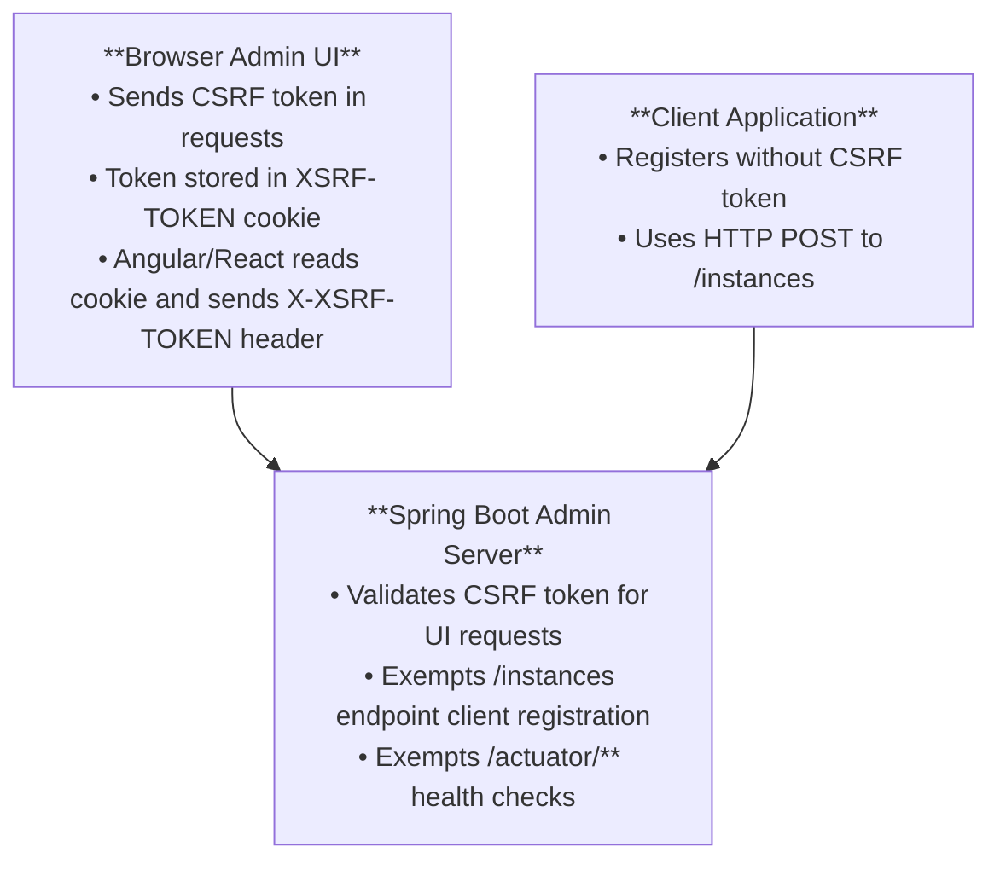

# CSRF Protection

Configure Cross-Site Request Forgery (CSRF) protection for Spring Boot Admin while allowing client registration.

## Overview

Spring Boot Admin Server needs CSRF protection for the web UI, but must exempt certain endpoints:

- `/instances` - Client registration endpoint (POST)
- `/instances/*` - Client deregistration endpoint (DELETE)
- `/actuator/**` - Admin Server's own actuator endpoints



---

## Why CSRF Protection?

CSRF attacks trick authenticated users into performing unwanted actions:

1. User logs into Admin Server in their browser
2. User visits malicious website
3. Malicious website sends request to Admin Server using user's session
4. Without CSRF protection, the request succeeds

**CSRF tokens prevent this**:

- Each request requires a unique token
- Tokens are tied to the user's session
- Malicious websites cannot obtain valid tokens

---

## CSRF Configuration

### Complete Example

```java
package com.example.admin;

import org.springframework.context.annotation.Bean;
import org.springframework.context.annotation.Configuration;
import org.springframework.security.config.annotation.web.builders.HttpSecurity;
import org.springframework.security.web.SecurityFilterChain;
import org.springframework.security.web.authentication.www.BasicAuthenticationFilter;
import org.springframework.security.web.csrf.CookieCsrfTokenRepository;
import org.springframework.security.web.csrf.CsrfTokenRequestAttributeHandler;
import org.springframework.security.web.servlet.util.matcher.PathPatternRequestMatcher;

import de.codecentric.boot.admin.server.config.AdminServerProperties;

import static org.springframework.http.HttpMethod.DELETE;
import static org.springframework.http.HttpMethod.POST;

@Configuration
public class SecurityConfig {

    private final AdminServerProperties adminServer;

    public SecurityConfig(AdminServerProperties adminServer) {
        this.adminServer = adminServer;
    }

    @Bean
    public SecurityFilterChain filterChain(HttpSecurity http) throws Exception {
        http
            .authorizeHttpRequests(auth -> auth
                .requestMatchers(PathPatternRequestMatcher.withDefaults()
                    .matcher(adminServer.path("/assets/**")))
                .permitAll()
                .requestMatchers(PathPatternRequestMatcher.withDefaults()
                    .matcher(adminServer.path("/login")))
                .permitAll()
                .anyRequest().authenticated()
            )
            .formLogin(formLogin -> formLogin
                .loginPage(adminServer.path("/login"))
            )
            .httpBasic(Customizer.withDefaults());

        // Custom CSRF filter to expose token to JavaScript
        http.addFilterAfter(new CustomCsrfFilter(), BasicAuthenticationFilter.class);

        // CSRF configuration
        http.csrf(csrf -> csrf
            // Use cookie-based token repository (accessible to JavaScript)
            .csrfTokenRepository(CookieCsrfTokenRepository.withHttpOnlyFalse())
            // Use attribute-based token handler
            .csrfTokenRequestHandler(new CsrfTokenRequestAttributeHandler())
            // Exempt specific endpoints
            .ignoringRequestMatchers(
                // Client registration
                PathPatternRequestMatcher.withDefaults()
                    .matcher(POST, adminServer.path("/instances")),
                // Client deregistration
                PathPatternRequestMatcher.withDefaults()
                    .matcher(DELETE, adminServer.path("/instances/*")),
                // Notification endpoints
                PathPatternRequestMatcher.withDefaults()
                    .matcher(POST, adminServer.path("/notifications/**")),
                PathPatternRequestMatcher.withDefaults()
                    .matcher(DELETE, adminServer.path("/notifications/**")),
                // Admin Server's own actuator
                PathPatternRequestMatcher.withDefaults()
                    .matcher(adminServer.path("/actuator/**"))
            )
        );

        return http.build();
    }
}
```

---

## Custom CSRF Filter

The Admin UI (JavaScript) needs access to the CSRF token. Create a filter to expose it:

```java
package com.example.admin;

import java.io.IOException;

import jakarta.servlet.FilterChain;
import jakarta.servlet.ServletException;
import jakarta.servlet.http.Cookie;
import jakarta.servlet.http.HttpServletRequest;
import jakarta.servlet.http.HttpServletResponse;
import org.springframework.security.web.csrf.CsrfToken;
import org.springframework.web.filter.OncePerRequestFilter;
import org.springframework.web.util.WebUtils;

public class CustomCsrfFilter extends OncePerRequestFilter {

    public static final String CSRF_COOKIE_NAME = "XSRF-TOKEN";

    @Override
    protected void doFilterInternal(HttpServletRequest request,
                                    HttpServletResponse response,
                                    FilterChain filterChain)
            throws ServletException, IOException {

        // Get CSRF token from request attributes
        CsrfToken csrf = (CsrfToken) request.getAttribute(CsrfToken.class.getName());

        if (csrf != null) {
            Cookie cookie = WebUtils.getCookie(request, CSRF_COOKIE_NAME);
            String token = csrf.getToken();

            // Set cookie if not present or token changed
            if (cookie == null || token != null && !token.equals(cookie.getValue())) {
                cookie = new Cookie(CSRF_COOKIE_NAME, token);
                cookie.setPath("/");
                response.addCookie(cookie);
            }
        }

        filterChain.doFilter(request, response);
    }
}
```

**What this does**:

1. Extracts CSRF token from Spring Security
2. Stores it in a cookie named `XSRF-TOKEN`
3. Cookie is **not** HTTP-only (JavaScript can read it)
4. Admin UI reads cookie and includes token in requests

---

## How CSRF Works in Admin Server

### 1. User Opens Admin UI

```
GET / HTTP/1.1
```

**Response**:

```
HTTP/1.1 200 OK
Set-Cookie: XSRF-TOKEN=abc123; Path=/
Set-Cookie: JSESSIONID=xyz789; Path=/; HttpOnly

<!DOCTYPE html>
<html>...</html>
```

### 2. JavaScript Makes Request

Admin UI JavaScript reads `XSRF-TOKEN` cookie and sends it in header:

```javascript
fetch('/instances/123/actuator/info', {
  method: 'GET',
  headers: {
    'X-XSRF-TOKEN': 'abc123'  // From cookie
  },
  credentials: 'same-origin'
})
```

**HTTP Request**:

```
GET /instances/123/actuator/info HTTP/1.1
X-XSRF-TOKEN: abc123
Cookie: XSRF-TOKEN=abc123; JSESSIONID=xyz789
```

### 3. Spring Security Validates Token

Spring Security compares:

- Token from `X-XSRF-TOKEN` header
- Token from `XSRF-TOKEN` cookie

If they match, request is allowed.

### 4. Client Registration (Exempted)

Client applications register **without** CSRF token:

```
POST /instances HTTP/1.1
Content-Type: application/json

{
  "name": "my-service",
  "healthUrl": "http://localhost:8081/actuator/health"
}
```

This works because `/instances` is in `ignoringRequestMatchers`.

---

## Cookie vs Session Token Repository

### Cookie-Based (Recommended for SPA)

```java
.csrfTokenRepository(CookieCsrfTokenRepository.withHttpOnlyFalse())
```

**Pros**:

- JavaScript can read token from cookie
- Works with Single Page Applications (SPA)
- Stateless (no server-side session storage)

**Cons**:

- Cookie not HTTP-only (accessible to JavaScript)
- Requires custom filter to set cookie

### Session-Based (Default)

```java
.csrfTokenRepository(new HttpSessionCsrfTokenRepository())
```

**Pros**:

- More secure (token not exposed to JavaScript)
- Simpler configuration

**Cons**:

- Requires server-side session
- Harder to use with SPA frameworks

**Spring Boot Admin requires cookie-based** because the UI is a JavaScript SPA.

---

## Exempted Endpoints

### Client Registration

```java
.ignoringRequestMatchers(
    PathPatternRequestMatcher.withDefaults()
        .matcher(POST, adminServer.path("/instances")),
    PathPatternRequestMatcher.withDefaults()
        .matcher(DELETE, adminServer.path("/instances/*"))
)
```

**Why?**

- Client applications don't have CSRF tokens
- They register/deregister via simple HTTP POST/DELETE
- Not vulnerable to CSRF (no browser session involved)

### Actuator Endpoints

```java
.ignoringRequestMatchers(
    PathPatternRequestMatcher.withDefaults()
        .matcher(adminServer.path("/actuator/**"))
)
```

**Why?**

- Admin Server's own health checks
- Load balancers, monitoring tools access these
- No CSRF risk (stateless, no session)

### Notification Endpoints

```java
.ignoringRequestMatchers(
    PathPatternRequestMatcher.withDefaults()
        .matcher(POST, adminServer.path("/notifications/**")),
    PathPatternRequestMatcher.withDefaults()
        .matcher(DELETE, adminServer.path("/notifications/**"))
)
```

**Why?**

- Webhook endpoints from external services (Slack, Teams, etc.)
- Cannot provide CSRF tokens
- Authenticated via other means (webhook secrets)

---

## Context Path Support

If using a custom context path:

```yaml
spring:
  boot:
    admin:
      context-path: /admin
```

Use `adminServer.path()` to include context path automatically:

```java
PathPatternRequestMatcher.withDefaults()
    .matcher(POST, adminServer.path("/instances"))
```

This becomes `/admin/instances` automatically.

---

## Testing CSRF Protection

### Test UI Request (Requires Token)

**Without token**:

```bash
curl -X POST http://localhost:8080/applications/my-app/restart \
  -H "Cookie: JSESSIONID=abc123"
```

**Response**: `403 Forbidden`

**With token**:

```bash
curl -X POST http://localhost:8080/applications/my-app/restart \
  -H "Cookie: JSESSIONID=abc123; XSRF-TOKEN=def456" \
  -H "X-XSRF-TOKEN: def456"
```

**Response**: `200 OK`

### Test Client Registration (Exempted)

```bash
curl -X POST http://localhost:8080/instances \
  -H "Content-Type: application/json" \
  -d '{
    "name": "test-service",
    "healthUrl": "http://localhost:8081/actuator/health"
  }'
```

**Response**: `201 Created` (no CSRF token needed)

### Test Actuator (Exempted)

```bash
curl http://localhost:8080/actuator/health
```

**Response**: `200 OK` (no CSRF token needed)

---

## Disable CSRF (Not Recommended)

For development/testing only:

```java
@Bean
@Profile("dev")
public SecurityFilterChain filterChain(HttpSecurity http) throws Exception {
    http
        .authorizeHttpRequests(/* ... */)
        .csrf(csrf -> csrf.disable());  // Disable CSRF

    return http.build();
}
```

**Only disable CSRF for development and testing.**

---

## SameSite Cookie Attribute

Enhance CSRF protection with SameSite cookies:

```yaml
server:
  servlet:
    session:
      cookie:
        same-site: strict
```

**Options**:

- `strict`: Cookie only sent for same-site requests (most secure)
- `lax`: Cookie sent for top-level navigation (default)
- `none`: Cookie sent for all requests (requires `secure=true`)

**Recommendation**: Use `lax` for Admin Server (allows direct navigation).

---

## Troubleshooting

### Issue: 403 Forbidden on all requests

**Cause**: CSRF token missing or invalid.

**Check**:

1. Cookie is set:

   ```bash
   curl -i http://localhost:8080/
   ```

   Should see `Set-Cookie: XSRF-TOKEN=...`

2. Custom CSRF filter is registered:

   ```java
   http.addFilterAfter(new CustomCsrfFilter(), BasicAuthenticationFilter.class)
   ```

3. Token repository is cookie-based:

   ```java
   .csrfTokenRepository(CookieCsrfTokenRepository.withHttpOnlyFalse())
   ```

### Issue: Client registration fails with 403

**Cause**: `/instances` endpoint not exempted from CSRF.

**Solution**: Add to `ignoringRequestMatchers`:

```java
.csrf(csrf -> csrf
    .ignoringRequestMatchers(
        PathPatternRequestMatcher.withDefaults()
            .matcher(POST, adminServer.path("/instances")),
        PathPatternRequestMatcher.withDefaults()
            .matcher(DELETE, adminServer.path("/instances/*"))
    )
)
```

### Issue: Token cookie not accessible to JavaScript

**Cause**: Cookie is HTTP-only.

**Solution**: Use `withHttpOnlyFalse()`:

```java
.csrfTokenRepository(CookieCsrfTokenRepository.withHttpOnlyFalse())
```

### Issue: Token changes on every request

**Expected behavior**. Spring Security generates new tokens regularly for security.

**If problematic**: Use `CookieCsrfTokenRepository` with custom settings:

```java
CookieCsrfTokenRepository repository = CookieCsrfTokenRepository.withHttpOnlyFalse();
repository.setCookieName("XSRF-TOKEN");
repository.setHeaderName("X-XSRF-TOKEN");
```

### Issue: CSRF protection not working with context path

**Cause**: Matchers don't include context path.

**Solution**: Use `adminServer.path()`:

```java
PathPatternRequestMatcher.withDefaults()
    .matcher(POST, adminServer.path("/instances"))
```

Not:

```java
new AntPathRequestMatcher("/instances", POST.name())
```

---

## Advanced Configuration

### Custom Token Header/Cookie Names

```java
CookieCsrfTokenRepository repository = new CookieCsrfTokenRepository();
repository.setCookieName("MY-CSRF-TOKEN");
repository.setHeaderName("X-MY-CSRF-TOKEN");
repository.setParameterName("_csrf");
repository.setCookieHttpOnly(false);

http.csrf(csrf -> csrf
    .csrfTokenRepository(repository)
)
```

Update `CustomCsrfFilter` accordingly:

```java
public static final String CSRF_COOKIE_NAME = "MY-CSRF-TOKEN";
```

### Conditional CSRF Protection

Enable CSRF only for browser requests:

```java
http.csrf(csrf -> csrf
    .requireCsrfProtectionMatcher(request -> {
        // Require CSRF for browser requests (non-API)
        String method = request.getMethod();
        if ("GET".equals(method) || "HEAD".equals(method) ||
            "TRACE".equals(method) || "OPTIONS".equals(method)) {
            return false;  // Safe methods
        }

        String header = request.getHeader("X-Requested-With");
        if ("XMLHttpRequest".equals(header)) {
            return true;  // AJAX requests
        }

        String accept = request.getHeader("Accept");
        if (accept != null && accept.contains("application/json")) {
            return false;  // API clients
        }

        return true;  // Browser requests
    })
)
```

### Multiple Security Filter Chains

Separate CSRF rules for UI and API:

```java
@Configuration
public class SecurityConfig {

    @Bean
    @Order(1)
    public SecurityFilterChain apiFilterChain(HttpSecurity http,
                                              AdminServerProperties adminServer) throws Exception {
        http
            .securityMatcher(adminServer.path("/api/**"))
            .authorizeHttpRequests(auth -> auth.anyRequest().authenticated())
            .httpBasic(Customizer.withDefaults())
            .csrf(csrf -> csrf.disable());  // No CSRF for API

        return http.build();
    }

    @Bean
    @Order(2)
    public SecurityFilterChain uiFilterChain(HttpSecurity http,
                                             AdminServerProperties adminServer) throws Exception {
        http
            .authorizeHttpRequests(auth -> auth.anyRequest().authenticated())
            .formLogin(/* ... */)
            .csrf(csrf -> csrf  // CSRF for UI
                .csrfTokenRepository(CookieCsrfTokenRepository.withHttpOnlyFalse())
            );

        return http.build();
    }
}
```

---

## Best Practices

1. **Always enable CSRF** when deploying
2. **Use cookie-based repository** for JavaScript SPAs
3. **Exempt only necessary endpoints** (client registration, actuator)
4. **Use SameSite cookies** for additional protection
5. **Test CSRF protection** before deploying
6. **Use HTTPS** to prevent token theft
7. **Rotate session IDs** after login
8. **Monitor for CSRF attacks** in logs

---

## Complete Working Example

**SecurityConfig.java**:

```java
package com.example.admin;

import java.util.UUID;

import org.springframework.context.annotation.Bean;
import org.springframework.context.annotation.Configuration;
import org.springframework.security.config.Customizer;
import org.springframework.security.config.annotation.web.builders.HttpSecurity;
import org.springframework.security.core.userdetails.User;
import org.springframework.security.core.userdetails.UserDetails;
import org.springframework.security.crypto.bcrypt.BCryptPasswordEncoder;
import org.springframework.security.crypto.password.PasswordEncoder;
import org.springframework.security.provisioning.InMemoryUserDetailsManager;
import org.springframework.security.web.SecurityFilterChain;
import org.springframework.security.web.authentication.SavedRequestAwareAuthenticationSuccessHandler;
import org.springframework.security.web.authentication.www.BasicAuthenticationFilter;
import org.springframework.security.web.csrf.CookieCsrfTokenRepository;
import org.springframework.security.web.csrf.CsrfTokenRequestAttributeHandler;
import org.springframework.security.web.servlet.util.matcher.PathPatternRequestMatcher;

import de.codecentric.boot.admin.server.config.AdminServerProperties;

import static org.springframework.http.HttpMethod.DELETE;
import static org.springframework.http.HttpMethod.POST;

@Configuration
public class SecurityConfig {

    private final AdminServerProperties adminServer;

    public SecurityConfig(AdminServerProperties adminServer) {
        this.adminServer = adminServer;
    }

    @Bean
    public SecurityFilterChain filterChain(HttpSecurity http) throws Exception {
        SavedRequestAwareAuthenticationSuccessHandler successHandler =
            new SavedRequestAwareAuthenticationSuccessHandler();
        successHandler.setTargetUrlParameter("redirectTo");
        successHandler.setDefaultTargetUrl(adminServer.path("/"));

        http
            .authorizeHttpRequests(auth -> auth
                .requestMatchers(PathPatternRequestMatcher.withDefaults()
                    .matcher(adminServer.path("/assets/**")))
                .permitAll()
                .requestMatchers(PathPatternRequestMatcher.withDefaults()
                    .matcher(adminServer.path("/login")))
                .permitAll()
                .requestMatchers(PathPatternRequestMatcher.withDefaults()
                    .matcher(adminServer.path("/actuator/info")))
                .permitAll()
                .requestMatchers(PathPatternRequestMatcher.withDefaults()
                    .matcher(adminServer.path("/actuator/health")))
                .permitAll()
                .anyRequest().authenticated()
            )
            .formLogin(formLogin -> formLogin
                .loginPage(adminServer.path("/login"))
                .successHandler(successHandler)
            )
            .logout(logout -> logout
                .logoutUrl(adminServer.path("/logout"))
            )
            .httpBasic(Customizer.withDefaults());

        http.addFilterAfter(new CustomCsrfFilter(), BasicAuthenticationFilter.class)
            .csrf(csrf -> csrf
                .csrfTokenRepository(CookieCsrfTokenRepository.withHttpOnlyFalse())
                .csrfTokenRequestHandler(new CsrfTokenRequestAttributeHandler())
                .ignoringRequestMatchers(
                    PathPatternRequestMatcher.withDefaults()
                        .matcher(POST, adminServer.path("/instances")),
                    PathPatternRequestMatcher.withDefaults()
                        .matcher(DELETE, adminServer.path("/instances/*")),
                    PathPatternRequestMatcher.withDefaults()
                        .matcher(adminServer.path("/actuator/**"))
                )
            );

        http.rememberMe(rememberMe -> rememberMe
            .key(UUID.randomUUID().toString())
            .tokenValiditySeconds(1209600)
        );

        return http.build();
    }

    @Bean
    public InMemoryUserDetailsManager userDetailsService(PasswordEncoder passwordEncoder) {
        UserDetails user = User.builder()
            .username("admin")
            .password(passwordEncoder.encode(System.getenv("ADMIN_PASSWORD")))
            .roles("ADMIN")
            .build();

        return new InMemoryUserDetailsManager(user);
    }

    @Bean
    public PasswordEncoder passwordEncoder() {
        return new BCryptPasswordEncoder();
    }
}
```

**CustomCsrfFilter.java** (same as shown earlier).

---

## See Also

- [Server Authentication](./10-server-authentication.md) - Configure Spring Security
- [Actuator Security](./20-actuator-security.md) - Secure client endpoints
- [Spring Security CSRF Documentation](https://docs.spring.io/spring-security/reference/servlet/exploits/csrf.html)
