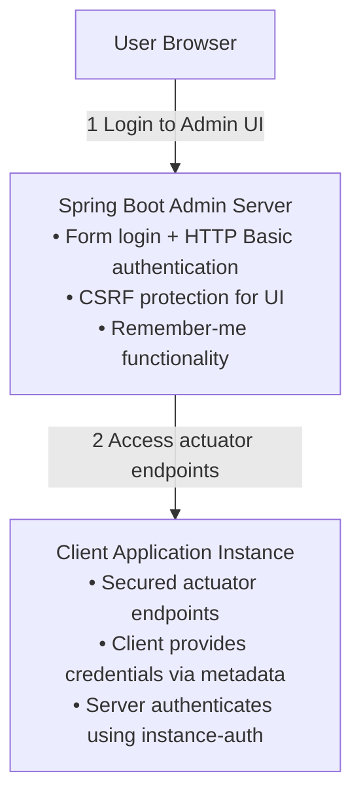

# Security

Spring Boot Admin Server and Client can be secured using Spring Security. This section covers all aspects of securing
your Spring Boot Admin deployment.

## Security Overview

A complete Spring Boot Admin deployment has multiple security concerns:



## Security Layers

### 1. Admin Server Security

Protect the Admin UI and API endpoints:

- **Authentication**: Form login for UI, HTTP Basic for API clients
- **Authorization**: Role-based access control
- **CSRF Protection**: Protect against Cross-Site Request Forgery
- **Session Management**: Remember-me functionality

**See**: [Server Authentication](./10-server-authentication.md)

### 2. Actuator Endpoint Security

Secure the client application's actuator endpoints:

- **Spring Security**: Protect actuator with authentication
- **Credentials Sharing**: Pass credentials to Admin Server via metadata
- **Per-Service Auth**: Different credentials per service

**See**: [Actuator Security](./20-actuator-security.md)

### 3. CSRF Protection

Configure CSRF tokens for Admin UI while allowing client registration:

- **Cookie-based CSRF**: JavaScript-friendly token repository
- **Exempted Endpoints**: Allow `/instances` registration without CSRF
- **Custom CSRF Filter**: Make token available to JavaScript

**See**: [CSRF Protection](./30-csrf-protection.md)

### 4. Mutual TLS (Optional)

Enhanced security with client certificates:

- **mTLS Between Server and Clients**: Mutual authentication
- **Certificate Validation**: Trust only specific clients
- **SSL Configuration**: Keystore and truststore setup

---

## Quick Start Examples

### Minimal Secured Server

```yaml
spring:
  security:
    user:
      name: admin
      password: ${ADMIN_PASSWORD}
```

```java
@Configuration
public class SecurityConfig {

    @Bean
    public SecurityFilterChain filterChain(HttpSecurity http) throws Exception {
        http.authorizeHttpRequests(auth -> auth
                .requestMatchers("/assets/**").permitAll()
                .requestMatchers("/login").permitAll()
                .anyRequest().authenticated()
            )
            .formLogin(formLogin -> formLogin.loginPage("/login"))
            .httpBasic(Customizer.withDefaults());

        return http.build();
    }
}
```

### Client with Secured Actuator

**Client Configuration**:

```yaml
spring:
  boot:
    admin:
      client:
        url: http://admin-server:8080
        instance:
          metadata:
            user.name: actuator
            user.password: ${ACTUATOR_PASSWORD}

  security:
    user:
      name: actuator
      password: ${ACTUATOR_PASSWORD}

management:
  endpoints:
    web:
      exposure:
        include: "*"
```

**Server Configuration**:

```yaml
spring:
  boot:
    admin:
      instance-auth:
        enabled: true
        # Credentials from instance metadata
```

---

## Security Checklist

Use this checklist to ensure your deployment is secure:

### Admin Server

- [ ] Enable Spring Security
- [ ] Use strong passwords (externalize via environment variables)
- [ ] Configure form login for UI access
- [ ] Enable HTTP Basic for API/programmatic access
- [ ] Configure CSRF protection with exemptions for `/instances`
- [ ] Set up remember-me with secure random key
- [ ] Use HTTPS for deployments
- [ ] Restrict access by IP (if applicable)
- [ ] Configure session timeout
- [ ] Audit authentication attempts

### Client Applications

- [ ] Secure actuator endpoints with Spring Security
- [ ] Pass actuator credentials via metadata (`user.name`, `user.password`)
- [ ] Use strong actuator passwords
- [ ] Limit exposed actuator endpoints to necessary ones
- [ ] Use HTTPS for actuator if possible
- [ ] Verify Admin Server certificate (if using HTTPS)
- [ ] Consider mutual TLS for high-security environments

### Network Security

- [ ] Use HTTPS for all communication
- [ ] Configure firewalls to restrict Admin Server access
- [ ] Use VPN or private networks when possible
- [ ] Enable mutual TLS if required
- [ ] Monitor for suspicious access patterns

---

## Common Security Scenarios

### Scenario 1: Development Environment

**Goal**: Simple security for local development.

```yaml
# Admin Server
spring:
  security:
    user:
      name: user
      password: password
```

No actuator security needed in development.

### Scenario 2: Production with Role-Based Access

**Goal**: Different roles for read-only vs admin users.

```java
@Configuration
public class SecurityConfig {

    @Bean
    public SecurityFilterChain filterChain(HttpSecurity http) throws Exception {
        http.authorizeHttpRequests(auth -> auth
                .requestMatchers("/assets/**", "/login").permitAll()
                .requestMatchers("/instances/**").hasRole("ADMIN")
                .anyRequest().hasAnyRole("ADMIN", "USER")
            )
            .formLogin(formLogin -> formLogin.loginPage("/login"))
            .httpBasic(Customizer.withDefaults());

        return http.build();
    }

    @Bean
    public UserDetailsService userDetailsService(PasswordEncoder encoder) {
        UserDetails admin = User.builder()
            .username("admin")
            .password(encoder.encode(System.getenv("ADMIN_PASSWORD")))
            .roles("ADMIN")
            .build();

        UserDetails user = User.builder()
            .username("viewer")
            .password(encoder.encode(System.getenv("VIEWER_PASSWORD")))
            .roles("USER")
            .build();

        return new InMemoryUserDetailsManager(admin, user);
    }

    @Bean
    public PasswordEncoder passwordEncoder() {
        return new BCryptPasswordEncoder();
    }
}
```

### Scenario 3: Kubernetes with Service Accounts

**Goal**: Use Kubernetes service accounts for authentication.

```yaml
# Admin Server
spring:
  boot:
    admin:
      discovery:
        enabled: true

# Spring Security with OAuth2
spring:
  security:
    oauth2:
      client:
        registration:
          keycloak:
            client-id: spring-boot-admin
            client-secret: ${OAUTH2_CLIENT_SECRET}
        provider:
          keycloak:
            issuer-uri: https://keycloak.company.com/realms/main
```

### Scenario 4: Different Credentials per Service

**Goal**: Use unique credentials for each client service.

**Admin Server**:

```yaml
spring:
  boot:
    admin:
      instance-auth:
        enabled: true
        service-map:
          service-a:
            user-name: service-a-actuator
            user-password: ${SERVICE_A_PASSWORD}
          service-b:
            user-name: service-b-actuator
            user-password: ${SERVICE_B_PASSWORD}
        default-user-name: default-actuator
        default-password: ${DEFAULT_PASSWORD}
```

**Client (Service A)**:

```yaml
spring:
  application:
    name: service-a

  security:
    user:
      name: service-a-actuator
      password: ${SERVICE_A_PASSWORD}
```

---

## Best Practices

### 1. Externalize Secrets

Never hardcode passwords. Use environment variables or secret management:

```yaml
spring:
  security:
    user:
      name: ${ADMIN_USER:admin}
      password: ${ADMIN_PASSWORD}
```

**Docker**:

```bash
docker run -e ADMIN_PASSWORD=secret123 my-admin-server
```

**Kubernetes Secret**:

```yaml
apiVersion: v1
kind: Secret
metadata:
  name: admin-credentials
type: Opaque
data:
  password: c2VjcmV0MTIz  # base64 encoded
```

### 2. Use Strong Passwords

- Minimum 16 characters
- Mix of uppercase, lowercase, numbers, symbols
- Use password generators
- Rotate regularly

### 3. Limit Actuator Exposure

Only expose necessary endpoints:

```yaml
management:
  endpoints:
    web:
      exposure:
        include: health,info,metrics,loggers
```

### 4. Enable HTTPS

Use TLS for all communication:

```yaml
server:
  port: 8443
  ssl:
    enabled: true
    key-store: classpath:keystore.p12
    key-store-password: ${KEYSTORE_PASSWORD}
    key-store-type: PKCS12
```

### 5. Monitor Security Events

Log authentication attempts and failures:

```yaml
logging:
  level:
    org.springframework.security: DEBUG
    de.codecentric.boot.admin: DEBUG
```

---

## Security Headers

Configure security headers for the Admin UI:

```java
@Configuration
public class SecurityConfig {

    @Bean
    public SecurityFilterChain filterChain(HttpSecurity http) throws Exception {
        http
            .headers(headers -> headers
                .contentSecurityPolicy(csp -> csp
                    .policyDirectives("default-src 'self'; script-src 'self' 'unsafe-inline'; style-src 'self' 'unsafe-inline'")
                )
                .frameOptions(frame -> frame.sameOrigin())
                .xssProtection(xss -> xss.block(true))
                .httpStrictTransportSecurity(hsts -> hsts
                    .includeSubDomains(true)
                    .maxAgeInSeconds(31536000)
                )
            );

        return http.build();
    }
}
```

---

## Troubleshooting

### Issue: 401 Unauthorized when accessing instances

**Cause**: Admin Server doesn't have credentials to access actuator endpoints.

**Solution**: Add credentials to instance metadata:

```yaml
spring:
  boot:
    admin:
      client:
        instance:
          metadata:
            user.name: actuator
            user.password: ${ACTUATOR_PASSWORD}
```

### Issue: CSRF token errors on client registration

**Cause**: CSRF protection blocking `/instances` endpoint.

**Solution**: Exempt registration endpoints from CSRF:

```java
.csrf(csrf -> csrf
    .ignoringRequestMatchers(
        new AntPathRequestMatcher("/instances", POST.name()),
        new AntPathRequestMatcher("/instances/*", DELETE.name())
    )
)
```

### Issue: Login page not loading

**Cause**: Login page assets blocked by security.

**Solution**: Permit access to assets and login:

```java
.authorizeHttpRequests(auth -> auth
    .requestMatchers("/assets/**", "/login").permitAll()
    .anyRequest().authenticated()
)
```

### Issue: Remember-me not working

**Cause**: No `UserDetailsService` configured.

**Solution**: Add `UserDetailsService` bean:

```java
@Bean
public InMemoryUserDetailsManager userDetailsService(PasswordEncoder encoder) {
    UserDetails user = User.builder()
        .username("admin")
        .password(encoder.encode("password"))
        .roles("ADMIN")
        .build();
    return new InMemoryUserDetailsManager(user);
}
```

---

## Next Steps

- [Server Authentication](./10-server-authentication.md) - Secure Admin Server with Spring Security
- [Actuator Security](./20-actuator-security.md) - Secure client actuator endpoints
- [CSRF Protection](./30-csrf-protection.md) - Configure CSRF for UI and API

---

## See Also

- [Server Configuration](../02-server/01-server.mdx)
- [Client Configuration](../03-client/10-client-features.md)
- [Spring Security Documentation](https://docs.spring.io/spring-security/reference/index.html)
