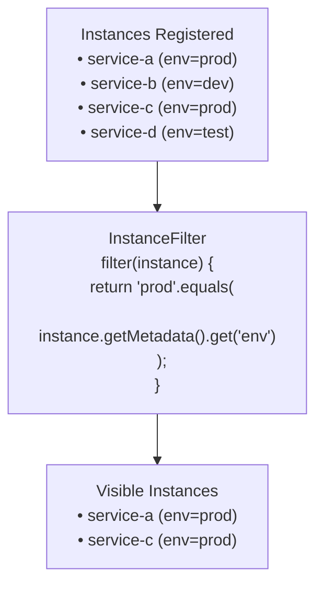

---

sidebar_position: 1
sidebar_custom_props:
  icon: 'wrench'
---

# Instance Filters

Filter which instances are visible and managed by Spring Boot Admin Server.

## Overview

`InstanceFilter` allows you to selectively include or exclude instances from being displayed and monitored by the Admin
Server.

**Use Cases**:

- Hide test/development instances in production Admin Server
- Filter instances by environment, region, or tags
- Exclude specific services from monitoring
- Show only instances matching certain criteria



---

## Default Behavior

By default, **all instances are visible**:

```java
@Bean
@ConditionalOnMissingBean
public InstanceFilter instanceFilter() {
    return instance -> true;  // Accept all instances
}
```

---

## InstanceFilter Interface

```java
package de.codecentric.boot.admin.server.services;

import de.codecentric.boot.admin.server.domain.entities.Instance;

@FunctionalInterface
public interface InstanceFilter {

    /**
     * Test if instance should be visible
     * @param instance the instance to filter
     * @return true if instance should be included, false to exclude
     */
    boolean filter(Instance instance);

}
```

---

## How It Works

`InstanceFilter` is applied by `InstanceRegistry`:

```java
public Flux<Instance> getInstances() {
    return repository.findAll().filter(filter::filter);
}

public Mono<Instance> getInstance(InstanceId id) {
    return repository.find(id).filter(filter::filter);
}
```

**Important**: Instances are **still stored** in the repository, but filtered from queries. This means:

- Filtered instances continue to be monitored
- Events are still generated for filtered instances
- Filtering only affects visibility in the UI and API

---

## Filter by Environment

Show only production instances:

```java
package com.example.admin;

import org.springframework.context.annotation.Bean;
import org.springframework.context.annotation.Configuration;

import de.codecentric.boot.admin.server.services.InstanceFilter;

@Configuration
public class InstanceFilterConfig {

    @Bean
    public InstanceFilter instanceFilter() {
        return instance -> {
            String env = instance.getRegistration()
                .getMetadata()
                .get("environment");

            return "production".equals(env);
        };
    }
}
```

**Client Configuration**:

```yaml
spring:
  boot:
    admin:
      client:
        instance:
          metadata:
            environment: production
```

---

## Filter by Tags

Show only instances with specific tags:

```java
package com.example.admin;

import org.springframework.context.annotation.Bean;
import org.springframework.context.annotation.Configuration;

import de.codecentric.boot.admin.server.services.InstanceFilter;

@Configuration
public class InstanceFilterConfig {

    @Bean
    public InstanceFilter instanceFilter() {
        return instance -> {
            String tags = instance.getRegistration()
                .getMetadata()
                .get("tags");

            if (tags == null) {
                return false;  // Exclude instances without tags
            }

            // Show instances with "production" or "critical" tag
            return tags.contains("production") || tags.contains("critical");
        };
    }
}
```

**Client Configuration**:

```yaml
spring:
  boot:
    admin:
      client:
        instance:
          metadata:
            tags: production,critical,payment
```

---

## Filter by Service Name

Exclude specific services:

```java
package com.example.admin;

import java.util.Set;

import org.springframework.context.annotation.Bean;
import org.springframework.context.annotation.Configuration;

import de.codecentric.boot.admin.server.services.InstanceFilter;

@Configuration
public class InstanceFilterConfig {

    @Bean
    public InstanceFilter instanceFilter() {
        Set<String> excludedServices = Set.of(
            "test-service",
            "dev-helper",
            "mock-service"
        );

        return instance -> {
            String serviceName = instance.getRegistration().getName();
            return !excludedServices.contains(serviceName);
        };
    }
}
```

---

## Filter by Status

Show only healthy instances:

```java
package com.example.admin;

import org.springframework.context.annotation.Bean;
import org.springframework.context.annotation.Configuration;

import de.codecentric.boot.admin.server.domain.values.StatusInfo;
import de.codecentric.boot.admin.server.services.InstanceFilter;

@Configuration
public class InstanceFilterConfig {

    @Bean
    public InstanceFilter instanceFilter() {
        return instance -> {
            StatusInfo status = instance.getStatusInfo();

            // Show only UP or UNKNOWN instances
            return status.isUp() || status.isUnknown();
        };
    }
}
```

**Status values**:

- `isUp()` - Instance is healthy
- `isDown()` - Instance is unhealthy
- `isOffline()` - Instance is unreachable
- `isUnknown()` - Status not yet determined

---

## Filter by URL Pattern

Show only instances from specific hosts:

```java
package com.example.admin;

import org.springframework.context.annotation.Bean;
import org.springframework.context.annotation.Configuration;

import de.codecentric.boot.admin.server.services.InstanceFilter;

@Configuration
public class InstanceFilterConfig {

    @Bean
    public InstanceFilter instanceFilter() {
        return instance -> {
            String serviceUrl = instance.getRegistration().getServiceUrl();

            // Show only instances on production domain
            return serviceUrl != null &&
                   serviceUrl.contains(".prod.company.com");
        };
    }
}
```

---

## Configurable Filter

Filter based on application properties:

**application.yml**:

```yaml
admin:
  filter:
    enabled: true
    environment: production
    tags:
      - critical
      - production
```

**Configuration**:

```java
package com.example.admin;

import java.util.List;

import org.springframework.boot.context.properties.ConfigurationProperties;
import org.springframework.boot.context.properties.EnableConfigurationProperties;
import org.springframework.context.annotation.Bean;
import org.springframework.context.annotation.Configuration;
import org.springframework.stereotype.Component;

import de.codecentric.boot.admin.server.services.InstanceFilter;

@Configuration
@EnableConfigurationProperties(FilterProperties.class)
public class InstanceFilterConfig {

    @Bean
    public InstanceFilter instanceFilter(FilterProperties filterProperties) {
        if (!filterProperties.isEnabled()) {
            return instance -> true;  // No filtering
        }

        return instance -> {
            String env = instance.getRegistration()
                .getMetadata()
                .get("environment");

            String tags = instance.getRegistration()
                .getMetadata()
                .get("tags");

            // Check environment
            if (filterProperties.getEnvironment() != null) {
                if (!filterProperties.getEnvironment().equals(env)) {
                    return false;
                }
            }

            // Check tags
            if (filterProperties.getTags() != null && !filterProperties.getTags().isEmpty()) {
                if (tags == null) {
                    return false;
                }

                for (String requiredTag : filterProperties.getTags()) {
                    if (tags.contains(requiredTag)) {
                        return true;
                    }
                }
                return false;
            }

            return true;
        };
    }
}

@Component
@ConfigurationProperties(prefix = "admin.filter")
class FilterProperties {
    private boolean enabled = false;
    private String environment;
    private List<String> tags;

    // Getters and setters
    public boolean isEnabled() {
        return enabled;
    }

    public void setEnabled(boolean enabled) {
        this.enabled = enabled;
    }

    public String getEnvironment() {
        return environment;
    }

    public void setEnvironment(String environment) {
        this.environment = environment;
    }

    public List<String> getTags() {
        return tags;
    }

    public void setTags(List<String> tags) {
        this.tags = tags;
    }
}
```

---

## Multiple Conditions

Combine multiple filter conditions:

```java
package com.example.admin;

import java.util.Set;

import org.springframework.context.annotation.Bean;
import org.springframework.context.annotation.Configuration;

import de.codecentric.boot.admin.server.services.InstanceFilter;

@Configuration
public class InstanceFilterConfig {

    @Bean
    public InstanceFilter instanceFilter() {
        Set<String> allowedEnvironments = Set.of("production", "staging");
        Set<String> excludedServices = Set.of("test-service", "dev-tool");

        return instance -> {
            String env = instance.getRegistration()
                .getMetadata()
                .get("environment");

            String serviceName = instance.getRegistration().getName();

            // Include if:
            // 1. Environment is allowed AND
            // 2. Service is not excluded
            return allowedEnvironments.contains(env) &&
                   !excludedServices.contains(serviceName);
        };
    }
}
```

---

## Advanced Filtering

### Filter by Registration Time

Show only recently registered instances:

```java
package com.example.admin;

import java.time.Duration;
import java.time.Instant;

import org.springframework.context.annotation.Bean;
import org.springframework.context.annotation.Configuration;

import de.codecentric.boot.admin.server.services.InstanceFilter;

@Configuration
public class InstanceFilterConfig {

    @Bean
    public InstanceFilter instanceFilter() {
        return instance -> {
            Instant registrationTime = instance.getRegistration().getTimestamp();
            if (registrationTime == null) {
                return true;
            }

            // Show instances registered within last 7 days
            Duration age = Duration.between(registrationTime, Instant.now());
            return age.compareTo(Duration.ofDays(7)) < 0;
        };
    }
}
```

### Filter by Build Info

Show only instances with specific versions:

```java
package com.example.admin;

import org.springframework.context.annotation.Bean;
import org.springframework.context.annotation.Configuration;

import de.codecentric.boot.admin.server.services.InstanceFilter;

@Configuration
public class InstanceFilterConfig {

    @Bean
    public InstanceFilter instanceFilter() {
        return instance -> {
            if (instance.getInfo() == null || instance.getInfo().getValues() == null) {
                return true;  // No build info available
            }

            Object buildInfo = instance.getInfo().getValues().get("build");
            if (buildInfo instanceof Map) {
                Map<?, ?> build = (Map<?, ?>) buildInfo;
                String version = (String) build.get("version");

                // Only show version 2.x and above
                return version != null && !version.startsWith("1.");
            }

            return true;
        };
    }
}
```

### Database-Driven Filter

Load filter rules from database:

```java
package com.example.admin;

import org.springframework.context.annotation.Bean;
import org.springframework.context.annotation.Configuration;

import de.codecentric.boot.admin.server.services.InstanceFilter;

@Configuration
public class InstanceFilterConfig {

    @Bean
    public InstanceFilter instanceFilter(InstanceFilterRuleRepository repository) {
        return instance -> {
            String serviceName = instance.getRegistration().getName();
            String env = instance.getRegistration()
                .getMetadata()
                .get("environment");

            // Query database for filter rules
            return repository.shouldShowInstance(serviceName, env);
        };
    }
}

interface InstanceFilterRuleRepository {
    boolean shouldShowInstance(String serviceName, String environment);
}
```

---

## Composite Filters

Combine multiple filters with AND/OR logic:

```java
package com.example.admin;

import java.util.Arrays;
import java.util.List;

import org.springframework.context.annotation.Bean;
import org.springframework.context.annotation.Configuration;

import de.codecentric.boot.admin.server.services.InstanceFilter;

@Configuration
public class InstanceFilterConfig {

    @Bean
    public InstanceFilter instanceFilter() {
        InstanceFilter envFilter = instance -> {
            String env = instance.getRegistration()
                .getMetadata()
                .get("environment");
            return "production".equals(env);
        };

        InstanceFilter statusFilter = instance -> {
            return instance.getStatusInfo().isUp();
        };

        InstanceFilter tagsFilter = instance -> {
            String tags = instance.getRegistration()
                .getMetadata()
                .get("tags");
            return tags != null && tags.contains("monitored");
        };

        // Combine with AND logic
        return and(envFilter, statusFilter, tagsFilter);
    }

    private InstanceFilter and(InstanceFilter... filters) {
        return instance -> {
            for (InstanceFilter filter : filters) {
                if (!filter.filter(instance)) {
                    return false;
                }
            }
            return true;
        };
    }

    private InstanceFilter or(InstanceFilter... filters) {
        return instance -> {
            for (InstanceFilter filter : filters) {
                if (filter.filter(instance)) {
                    return true;
                }
            }
            return false;
        };
    }
}
```

---

## Testing Filters

### Unit Test

```java
package com.example.admin;

import java.util.Map;

import org.junit.jupiter.api.Test;

import de.codecentric.boot.admin.server.domain.entities.Instance;
import de.codecentric.boot.admin.server.domain.values.InstanceId;
import de.codecentric.boot.admin.server.domain.values.Registration;
import de.codecentric.boot.admin.server.services.InstanceFilter;

import static org.assertj.core.api.Assertions.assertThat;

class InstanceFilterTest {

    @Test
    void shouldFilterByEnvironment() {
        InstanceFilter filter = instance -> {
            String env = instance.getRegistration()
                .getMetadata()
                .get("environment");
            return "production".equals(env);
        };

        Instance prodInstance = createInstance("prod-service",
            Map.of("environment", "production"));
        Instance devInstance = createInstance("dev-service",
            Map.of("environment", "development"));

        assertThat(filter.filter(prodInstance)).isTrue();
        assertThat(filter.filter(devInstance)).isFalse();
    }

    private Instance createInstance(String name, Map<String, String> metadata) {
        Registration registration = Registration.builder()
            .name(name)
            .healthUrl("http://localhost:8080/actuator/health")
            .metadata(metadata)
            .build();

        return Instance.create(InstanceId.of("test-id"))
            .register(registration);
    }
}
```

---

## Troubleshooting

### Issue: Instances not appearing in UI

**Cause**: Filter is excluding them.

**Debug**:

```java
@Bean
public InstanceFilter instanceFilter() {
    return instance -> {
        boolean result = /* your filter logic */;

        // Log for debugging
        if (!result) {
            System.out.println("Filtered out: " +
                instance.getRegistration().getName());
        }

        return result;
    };
}
```

### Issue: Filter not applied

**Cause**: Multiple `InstanceFilter` beans defined.

**Solution**: Only define one `InstanceFilter` bean. Spring Boot Admin uses the first one it finds.

### Issue: Metadata not available

**Cause**: Client not sending metadata.

**Solution**: Verify client configuration:

```yaml
spring:
  boot:
    admin:
      client:
        instance:
          metadata:
            environment: production
```

---

## Best Practices

1. **Keep filters simple**: Complex filters can impact performance
2. **Document filter logic**: Make it clear why instances are excluded
3. **Test thoroughly**: Ensure correct instances are visible
4. **Use metadata**: Don't filter based on volatile data like status
5. **Consider multiple Admin Servers**: Instead of complex filtering, run separate Admin Servers for different
   environments

---

## Examples

### Example 1: Multi-Tenant Filter

```java
@Bean
public InstanceFilter instanceFilter(@Value("${tenant.id}") String tenantId) {
    return instance -> {
        String instanceTenant = instance.getRegistration()
            .getMetadata()
            .get("tenant");
        return tenantId.equals(instanceTenant);
    };
}
```

### Example 2: Region-Based Filter

```java
@Bean
public InstanceFilter instanceFilter(@Value("${aws.region}") String currentRegion) {
    return instance -> {
        String instanceRegion = instance.getRegistration()
            .getMetadata()
            .get("region");
        return currentRegion.equals(instanceRegion);
    };
}
```

### Example 3: Whitelist/Blacklist Filter

```java
@Bean
public InstanceFilter instanceFilter(
        @Value("${admin.whitelist:}") List<String> whitelist,
        @Value("${admin.blacklist:}") List<String> blacklist) {

    return instance -> {
        String serviceName = instance.getRegistration().getName();

        // Blacklist takes precedence
        if (blacklist.contains(serviceName)) {
            return false;
        }

        // If whitelist is empty, allow all (except blacklisted)
        if (whitelist.isEmpty()) {
            return true;
        }

        // Otherwise, only allow whitelisted
        return whitelist.contains(serviceName);
    };
}
```

**Configuration**:

```yaml
admin:
  whitelist:
    - payment-service
    - user-service
  blacklist:
    - test-service
```

---

## See Also

- [Server Configuration](../../02-server/01-server.mdx)
- [Custom Health Status](./02-custom-health-status.md)
- [Endpoint Detection](../server/04-endpoint-detection.md)
