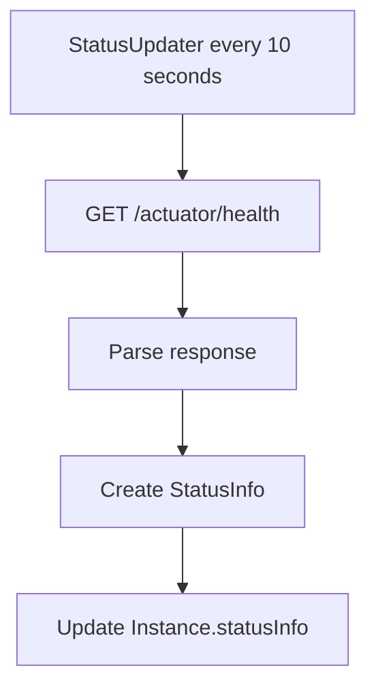

---

sidebar_position: 2
sidebar_custom_props:
  icon: 'wrench'
---

# Custom Health Status

Customize how Spring Boot Admin Server retrieves and interprets health status from instances.

## Overview

The Admin Server monitors instance health by querying the `/actuator/health` endpoint. You can customize:

1. **StatusUpdater** - How health status is retrieved and parsed
2. **InfoUpdater** - How instance info is retrieved
3. **Status interpretation** - Custom status codes and logic



---

## Default Behavior

### StatusUpdater

By default, `StatusUpdater` queries the health endpoint:

**StatusUpdater.java** (simplified):

```java
protected Mono<Instance> doUpdateStatus(Instance instance) {
    return instanceWebClient.instance(instance)
        .get()
        .uri(Endpoint.HEALTH)
        .exchangeToMono(this::convertStatusInfo)
        .timeout(Duration.ofSeconds(10))
        .onErrorResume(this::handleError)
        .map(instance::withStatusInfo);
}

protected StatusInfo getStatusInfoFromStatus(HttpStatusCode httpStatus, Map<String, ?> body) {
    if (httpStatus.is2xxSuccessful()) {
        return StatusInfo.ofUp();
    }
    // Return DOWN with error details
    return StatusInfo.ofDown(details);
}

private Mono<StatusInfo> handleError(Throwable ex) {
    Map<String, Object> details = new HashMap<>();
    details.put("message", ex.getMessage());
    details.put("exception", ex.getClass().getName());
    return Mono.just(StatusInfo.ofOffline(details));
}
```

**Status Mapping**:

- HTTP 2xx → `UP`
- HTTP 4xx/5xx → `DOWN`
- Network error → `OFFLINE`

---

## StatusInfo

### Built-in Status Codes

```java
public static final String STATUS_UNKNOWN = "UNKNOWN";
public static final String STATUS_OUT_OF_SERVICE = "OUT_OF_SERVICE";
public static final String STATUS_UP = "UP";
public static final String STATUS_DOWN = "DOWN";
public static final String STATUS_OFFLINE = "OFFLINE";
public static final String STATUS_RESTRICTED = "RESTRICTED";
```

**Status Priority** (highest to lowest):

1. `DOWN`
2. `OUT_OF_SERVICE`
3. `OFFLINE`
4. `UNKNOWN`
5. `RESTRICTED`
6. `UP`

### Creating StatusInfo

```java
// UP status
StatusInfo.ofUp();
StatusInfo.ofUp(Map.of("version", "1.0.0"));

// DOWN status
StatusInfo.ofDown();
StatusInfo.ofDown(Map.of("error", "Database unreachable"));

// OFFLINE status
StatusInfo.ofOffline();
StatusInfo.ofOffline(Map.of("message", "Connection timeout"));

// Custom status
StatusInfo.valueOf("DEGRADED", Map.of("reason", "High latency"));
```

---

## Custom StatusUpdater

### Example: Custom Timeout

```java
package com.example.admin;

import java.time.Duration;

import org.springframework.context.annotation.Bean;
import org.springframework.context.annotation.Configuration;

import de.codecentric.boot.admin.server.domain.entities.InstanceRepository;
import de.codecentric.boot.admin.server.services.ApiMediaTypeHandler;
import de.codecentric.boot.admin.server.services.StatusUpdater;
import de.codecentric.boot.admin.server.web.client.InstanceWebClient;

@Configuration
public class StatusUpdaterConfig {

    @Bean
    public StatusUpdater statusUpdater(
            InstanceRepository repository,
            InstanceWebClient instanceWebClient,
            ApiMediaTypeHandler apiMediaTypeHandler) {

        return new StatusUpdater(repository, instanceWebClient, apiMediaTypeHandler)
            .timeout(Duration.ofSeconds(30));  // Increase timeout
    }
}
```

### Example: Custom Status Interpretation

```java
package com.example.admin;

import java.util.Map;

import org.springframework.context.annotation.Bean;
import org.springframework.context.annotation.Configuration;
import org.springframework.http.HttpStatusCode;

import de.codecentric.boot.admin.server.domain.entities.InstanceRepository;
import de.codecentric.boot.admin.server.domain.values.StatusInfo;
import de.codecentric.boot.admin.server.services.ApiMediaTypeHandler;
import de.codecentric.boot.admin.server.services.StatusUpdater;
import de.codecentric.boot.admin.server.web.client.InstanceWebClient;

@Configuration
public class StatusUpdaterConfig {

    @Bean
    public StatusUpdater statusUpdater(
            InstanceRepository repository,
            InstanceWebClient instanceWebClient,
            ApiMediaTypeHandler apiMediaTypeHandler) {

        return new CustomStatusUpdater(repository, instanceWebClient, apiMediaTypeHandler);
    }

    static class CustomStatusUpdater extends StatusUpdater {

        public CustomStatusUpdater(
                InstanceRepository repository,
                InstanceWebClient instanceWebClient,
                ApiMediaTypeHandler apiMediaTypeHandler) {
            super(repository, instanceWebClient, apiMediaTypeHandler);
        }

        @Override
        protected StatusInfo getStatusInfoFromStatus(HttpStatusCode httpStatus, Map<String, ?> body) {
            // Custom logic: 503 Service Unavailable = OUT_OF_SERVICE
            if (httpStatus.value() == 503) {
                return StatusInfo.valueOf("OUT_OF_SERVICE", body);
            }

            // Custom logic: 429 Too Many Requests = RESTRICTED
            if (httpStatus.value() == 429) {
                return StatusInfo.valueOf("RESTRICTED",
                    Map.of("reason", "Rate limited"));
            }

            // Delegate to default behavior
            return super.getStatusInfoFromStatus(httpStatus, body);
        }
    }
}
```

### Example: Custom Health Endpoint

Query a different health endpoint:

```java
package com.example.admin;

import reactor.core.publisher.Mono;

import de.codecentric.boot.admin.server.domain.entities.Instance;
import de.codecentric.boot.admin.server.domain.entities.InstanceRepository;
import de.codecentric.boot.admin.server.services.ApiMediaTypeHandler;
import de.codecentric.boot.admin.server.services.StatusUpdater;
import de.codecentric.boot.admin.server.web.client.InstanceWebClient;

public class CustomHealthEndpointStatusUpdater extends StatusUpdater {

    public CustomHealthEndpointStatusUpdater(
            InstanceRepository repository,
            InstanceWebClient instanceWebClient,
            ApiMediaTypeHandler apiMediaTypeHandler) {
        super(repository, instanceWebClient, apiMediaTypeHandler);
    }

    @Override
    protected Mono<Instance> doUpdateStatus(Instance instance) {
        if (!instance.isRegistered()) {
            return Mono.empty();
        }

        // Query custom health endpoint based on metadata
        String customHealthPath = instance.getRegistration()
            .getMetadata()
            .getOrDefault("health-path", "/actuator/health");

        return instanceWebClient.instance(instance)
            .get()
            .uri(customHealthPath)
            .exchangeToMono(this::convertStatusInfo)
            .timeout(getTimeoutWithMargin())
            .onErrorResume(this::handleError)
            .map(instance::withStatusInfo);
    }
}
```

**Client Configuration**:

```yaml
spring:
  boot:
    admin:
      client:
        instance:
          metadata:
            health-path: /custom/health
```

### Example: Combine Multiple Health Checks

```java
package com.example.admin;

import java.util.Map;

import reactor.core.publisher.Mono;

import de.codecentric.boot.admin.server.domain.entities.Instance;
import de.codecentric.boot.admin.server.domain.entities.InstanceRepository;
import de.codecentric.boot.admin.server.domain.values.StatusInfo;
import de.codecentric.boot.admin.server.services.ApiMediaTypeHandler;
import de.codecentric.boot.admin.server.services.StatusUpdater;
import de.codecentric.boot.admin.server.web.client.InstanceWebClient;

public class AggregatedStatusUpdater extends StatusUpdater {

    public AggregatedStatusUpdater(
            InstanceRepository repository,
            InstanceWebClient instanceWebClient,
            ApiMediaTypeHandler apiMediaTypeHandler) {
        super(repository, instanceWebClient, apiMediaTypeHandler);
    }

    @Override
    protected Mono<Instance> doUpdateStatus(Instance instance) {
        if (!instance.isRegistered()) {
            return Mono.empty();
        }

        // Check both health and readiness
        Mono<StatusInfo> health = instanceWebClient.instance(instance)
            .get()
            .uri("/actuator/health")
            .exchangeToMono(this::convertStatusInfo)
            .onErrorResume(ex -> Mono.just(StatusInfo.ofOffline()));

        Mono<StatusInfo> readiness = instanceWebClient.instance(instance)
            .get()
            .uri("/actuator/health/readiness")
            .exchangeToMono(this::convertStatusInfo)
            .onErrorResume(ex -> Mono.just(StatusInfo.ofUp()));

        return Mono.zip(health, readiness, this::combineStatus)
            .map(instance::withStatusInfo);
    }

    private StatusInfo combineStatus(StatusInfo health, StatusInfo readiness) {
        // If either is DOWN, overall is DOWN
        if (health.isDown() || readiness.isDown()) {
            return StatusInfo.ofDown(Map.of(
                "health", health.getStatus(),
                "readiness", readiness.getStatus()
            ));
        }

        // If either is OFFLINE, overall is OFFLINE
        if (health.isOffline() || readiness.isOffline()) {
            return StatusInfo.ofOffline(Map.of(
                "health", health.getStatus(),
                "readiness", readiness.getStatus()
            ));
        }

        // Otherwise UP
        return StatusInfo.ofUp(Map.of(
            "health", health.getStatus(),
            "readiness", readiness.getStatus()
        ));
    }
}
```

---

## Custom InfoUpdater

### Default Behavior

`InfoUpdater` queries `/actuator/info`:

```java
protected Mono<Instance> doUpdateInfo(Instance instance) {
    if (instance.getStatusInfo().isOffline() || instance.getStatusInfo().isUnknown()) {
        return Mono.empty();  // Skip if offline
    }

    if (!instance.getEndpoints().isPresent(Endpoint.INFO)) {
        return Mono.empty();  // Skip if no info endpoint
    }

    return instanceWebClient.instance(instance)
        .get()
        .uri(Endpoint.INFO)
        .exchangeToMono(response -> convertInfo(instance, response))
        .onErrorResume(ex -> Mono.just(convertInfo(instance, ex)))
        .map(instance::withInfo);
}
```

### Example: Custom Info Endpoint

```java
package com.example.admin;

import reactor.core.publisher.Mono;

import de.codecentric.boot.admin.server.domain.entities.Instance;
import de.codecentric.boot.admin.server.domain.entities.InstanceRepository;
import de.codecentric.boot.admin.server.domain.values.Info;
import de.codecentric.boot.admin.server.services.ApiMediaTypeHandler;
import de.codecentric.boot.admin.server.services.InfoUpdater;
import de.codecentric.boot.admin.server.web.client.InstanceWebClient;

public class CustomInfoUpdater extends InfoUpdater {

    public CustomInfoUpdater(
            InstanceRepository repository,
            InstanceWebClient instanceWebClient,
            ApiMediaTypeHandler apiMediaTypeHandler) {
        super(repository, instanceWebClient, apiMediaTypeHandler);
    }

    @Override
    protected Mono<Instance> doUpdateInfo(Instance instance) {
        if (instance.getStatusInfo().isOffline() || instance.getStatusInfo().isUnknown()) {
            return Mono.empty();
        }

        // Query custom info endpoint
        String infoPath = instance.getRegistration()
            .getMetadata()
            .getOrDefault("info-path", "/actuator/info");

        return instanceWebClient.instance(instance)
            .get()
            .uri(infoPath)
            .exchangeToMono(response -> convertInfo(instance, response))
            .onErrorResume(ex -> Mono.just(Info.empty()))
            .map(instance::withInfo);
    }
}
```

### Example: Enrich Info with Metadata

```java
package com.example.admin;

import java.util.HashMap;
import java.util.Map;

import reactor.core.publisher.Mono;
import org.springframework.web.reactive.function.client.ClientResponse;

import de.codecentric.boot.admin.server.domain.entities.Instance;
import de.codecentric.boot.admin.server.domain.entities.InstanceRepository;
import de.codecentric.boot.admin.server.domain.values.Info;
import de.codecentric.boot.admin.server.services.ApiMediaTypeHandler;
import de.codecentric.boot.admin.server.services.InfoUpdater;
import de.codecentric.boot.admin.server.web.client.InstanceWebClient;

public class EnrichedInfoUpdater extends InfoUpdater {

    public EnrichedInfoUpdater(
            InstanceRepository repository,
            InstanceWebClient instanceWebClient,
            ApiMediaTypeHandler apiMediaTypeHandler) {
        super(repository, instanceWebClient, apiMediaTypeHandler);
    }

    @Override
    protected Mono<Info> convertInfo(Instance instance, ClientResponse response) {
        return super.convertInfo(instance, response)
            .map(info -> enrichInfo(instance, info));
    }

    private Info enrichInfo(Instance instance, Info originalInfo) {
        Map<String, Object> enriched = new HashMap<>(originalInfo.getValues());

        // Add metadata to info
        enriched.put("metadata", instance.getRegistration().getMetadata());

        // Add custom fields
        enriched.put("registrationTime",
            instance.getRegistration().getTimestamp().toString());

        enriched.put("instanceId", instance.getId().getValue());

        return Info.from(enriched);
    }
}
```

---

## Custom Status Codes

Define custom status codes for specific scenarios:

```java
package com.example.admin;

import java.util.Map;

import org.springframework.context.annotation.Bean;
import org.springframework.context.annotation.Configuration;
import org.springframework.http.HttpStatusCode;

import de.codecentric.boot.admin.server.domain.entities.InstanceRepository;
import de.codecentric.boot.admin.server.domain.values.StatusInfo;
import de.codecentric.boot.admin.server.services.ApiMediaTypeHandler;
import de.codecentric.boot.admin.server.services.StatusUpdater;
import de.codecentric.boot.admin.server.web.client.InstanceWebClient;

@Configuration
public class CustomStatusConfig {

    @Bean
    public StatusUpdater statusUpdater(
            InstanceRepository repository,
            InstanceWebClient instanceWebClient,
            ApiMediaTypeHandler apiMediaTypeHandler) {

        return new CustomStatusCodeUpdater(repository, instanceWebClient, apiMediaTypeHandler);
    }

    static class CustomStatusCodeUpdater extends StatusUpdater {

        public CustomStatusCodeUpdater(
                InstanceRepository repository,
                InstanceWebClient instanceWebClient,
                ApiMediaTypeHandler apiMediaTypeHandler) {
            super(repository, instanceWebClient, apiMediaTypeHandler);
        }

        @Override
        protected StatusInfo getStatusInfoFromStatus(HttpStatusCode httpStatus, Map<String, ?> body) {
            // Custom status codes
            if (body.containsKey("status")) {
                String status = body.get("status").toString();

                return switch (status) {
                    case "DEGRADED" -> StatusInfo.valueOf("DEGRADED",
                        Map.of("details", "Service running with reduced capacity"));
                    case "MAINTENANCE" -> StatusInfo.valueOf("OUT_OF_SERVICE",
                        Map.of("reason", "Under maintenance"));
                    case "WARMING_UP" -> StatusInfo.valueOf("RESTRICTED",
                        Map.of("reason", "Service is warming up"));
                    default -> super.getStatusInfoFromStatus(httpStatus, body);
                };
            }

            return super.getStatusInfoFromStatus(httpStatus, body);
        }
    }
}
```

**Client Health Indicator**:

```java
package com.example.client;

import org.springframework.boot.actuate.health.Health;
import org.springframework.boot.actuate.health.HealthIndicator;
import org.springframework.stereotype.Component;

@Component
public class CustomHealthIndicator implements HealthIndicator {

    private boolean warming = true;

    @Override
    public Health health() {
        if (warming) {
            return Health.status("WARMING_UP")
                .withDetail("progress", "50%")
                .build();
        }

        return Health.up().build();
    }
}
```

---

## Advanced Scenarios

### Scenario 1: External Health Check

Query an external monitoring service:

```java
package com.example.admin;

import org.springframework.web.reactive.function.client.WebClient;
import reactor.core.publisher.Mono;

import de.codecentric.boot.admin.server.domain.entities.Instance;
import de.codecentric.boot.admin.server.domain.entities.InstanceRepository;
import de.codecentric.boot.admin.server.domain.values.StatusInfo;
import de.codecentric.boot.admin.server.services.ApiMediaTypeHandler;
import de.codecentric.boot.admin.server.services.StatusUpdater;
import de.codecentric.boot.admin.server.web.client.InstanceWebClient;

public class ExternalHealthCheckStatusUpdater extends StatusUpdater {

    private final WebClient externalMonitor;

    public ExternalHealthCheckStatusUpdater(
            InstanceRepository repository,
            InstanceWebClient instanceWebClient,
            ApiMediaTypeHandler apiMediaTypeHandler,
            WebClient.Builder webClientBuilder) {
        super(repository, instanceWebClient, apiMediaTypeHandler);
        this.externalMonitor = webClientBuilder
            .baseUrl("https://monitoring-service.company.com")
            .build();
    }

    @Override
    protected Mono<Instance> doUpdateStatus(Instance instance) {
        String serviceName = instance.getRegistration().getName();

        // Query external monitoring service
        Mono<StatusInfo> externalStatus = externalMonitor.get()
            .uri("/health/{service}", serviceName)
            .retrieve()
            .bodyToMono(ExternalHealthResponse.class)
            .map(this::convertExternalHealth)
            .onErrorResume(ex -> super.doUpdateStatus(instance)
                .map(Instance::getStatusInfo));

        return externalStatus.map(instance::withStatusInfo);
    }

    private StatusInfo convertExternalHealth(ExternalHealthResponse response) {
        return StatusInfo.valueOf(response.getStatus(), response.getDetails());
    }

    record ExternalHealthResponse(String status, Map<String, Object> details) {
        public String getStatus() { return status; }
        public Map<String, Object> getDetails() { return details; }
    }
}
```

### Scenario 2: Synthetic Monitoring

Perform synthetic transactions:

```java
package com.example.admin;

import java.util.Map;

import reactor.core.publisher.Mono;

import de.codecentric.boot.admin.server.domain.entities.Instance;
import de.codecentric.boot.admin.server.domain.entities.InstanceRepository;
import de.codecentric.boot.admin.server.domain.values.StatusInfo;
import de.codecentric.boot.admin.server.services.ApiMediaTypeHandler;
import de.codecentric.boot.admin.server.services.StatusUpdater;
import de.codecentric.boot.admin.server.web.client.InstanceWebClient;

public class SyntheticMonitoringStatusUpdater extends StatusUpdater {

    public SyntheticMonitoringStatusUpdater(
            InstanceRepository repository,
            InstanceWebClient instanceWebClient,
            ApiMediaTypeHandler apiMediaTypeHandler) {
        super(repository, instanceWebClient, apiMediaTypeHandler);
    }

    @Override
    protected Mono<Instance> doUpdateStatus(Instance instance) {
        // 1. Check health endpoint
        Mono<StatusInfo> healthCheck = super.doUpdateStatus(instance)
            .map(Instance::getStatusInfo);

        // 2. Perform synthetic transaction
        Mono<Boolean> syntheticCheck = performSyntheticTransaction(instance);

        return Mono.zip(healthCheck, syntheticCheck,
            (health, synthetic) -> {
                if (health.isDown()) {
                    return health;  // Already down
                }

                if (!synthetic) {
                    return StatusInfo.valueOf("DEGRADED",
                        Map.of("reason", "Synthetic transaction failed"));
                }

                return health;
            })
            .map(instance::withStatusInfo);
    }

    private Mono<Boolean> performSyntheticTransaction(Instance instance) {
        // Example: Try to fetch a known endpoint
        return instanceWebClient.instance(instance)
            .get()
            .uri("/api/health-check")
            .retrieve()
            .toBodilessEntity()
            .map(response -> response.getStatusCode().is2xxSuccessful())
            .onErrorReturn(false);
    }
}
```

### Scenario 3: Database-Backed Status

Store and retrieve status from database:

```java
package com.example.admin;

import reactor.core.publisher.Mono;

import de.codecentric.boot.admin.server.domain.entities.Instance;
import de.codecentric.boot.admin.server.domain.entities.InstanceRepository;
import de.codecentric.boot.admin.server.domain.values.StatusInfo;
import de.codecentric.boot.admin.server.services.ApiMediaTypeHandler;
import de.codecentric.boot.admin.server.services.StatusUpdater;
import de.codecentric.boot.admin.server.web.client.InstanceWebClient;

public class DatabaseBackedStatusUpdater extends StatusUpdater {

    private final HealthStatusRepository healthStatusRepository;

    public DatabaseBackedStatusUpdater(
            InstanceRepository repository,
            InstanceWebClient instanceWebClient,
            ApiMediaTypeHandler apiMediaTypeHandler,
            HealthStatusRepository healthStatusRepository) {
        super(repository, instanceWebClient, apiMediaTypeHandler);
        this.healthStatusRepository = healthStatusRepository;
    }

    @Override
    protected Mono<Instance> doUpdateStatus(Instance instance) {
        return super.doUpdateStatus(instance)
            .flatMap(updatedInstance -> {
                // Save status to database
                HealthStatus status = new HealthStatus(
                    instance.getId().getValue(),
                    updatedInstance.getStatusInfo().getStatus(),
                    updatedInstance.getStatusInfo().getDetails()
                );

                return healthStatusRepository.save(status)
                    .thenReturn(updatedInstance);
            });
    }
}

interface HealthStatusRepository {
    Mono<HealthStatus> save(HealthStatus status);
}

record HealthStatus(String instanceId, String status, Map<String, Object> details) {}
```

---

## Debugging

### Enable Debug Logging

```yaml
logging:
  level:
    de.codecentric.boot.admin.server.services.StatusUpdater: DEBUG
    de.codecentric.boot.admin.server.services.InfoUpdater: DEBUG
```

**Log Output**:

```
DEBUG StatusUpdater - Update status for Instance{id=abc123, name=my-service}
DEBUG StatusUpdater - Status updated: UP
```

### Monitor Status Updates

Listen to `InstanceStatusChangedEvent`:

```java
package com.example.admin;

import org.slf4j.Logger;
import org.slf4j.LoggerFactory;
import org.springframework.context.event.EventListener;
import org.springframework.stereotype.Component;

import de.codecentric.boot.admin.server.domain.events.InstanceStatusChangedEvent;

@Component
public class StatusChangeLogger {

    private static final Logger log = LoggerFactory.getLogger(StatusChangeLogger.class);

    @EventListener
    public void onStatusChanged(InstanceStatusChangedEvent event) {
        log.info("Status changed for instance {}: {} -> {}",
            event.getInstance(),
            event.getStatusInfo().getStatus(),
            event.getInstance().getStatusInfo().getStatus());
    }
}
```

---

## Complete Example

```java
package com.example.admin;

import java.time.Duration;
import java.util.Map;

import org.springframework.context.annotation.Bean;
import org.springframework.context.annotation.Configuration;
import org.springframework.http.HttpStatusCode;

import de.codecentric.boot.admin.server.domain.entities.InstanceRepository;
import de.codecentric.boot.admin.server.domain.values.StatusInfo;
import de.codecentric.boot.admin.server.services.ApiMediaTypeHandler;
import de.codecentric.boot.admin.server.services.StatusUpdater;
import de.codecentric.boot.admin.server.web.client.InstanceWebClient;

@Configuration
public class CustomMonitoringConfig {

    @Bean
    public StatusUpdater statusUpdater(
            InstanceRepository repository,
            InstanceWebClient instanceWebClient,
            ApiMediaTypeHandler apiMediaTypeHandler) {

        return new EnhancedStatusUpdater(repository, instanceWebClient, apiMediaTypeHandler)
            .timeout(Duration.ofSeconds(15));
    }

    static class EnhancedStatusUpdater extends StatusUpdater {

        public EnhancedStatusUpdater(
                InstanceRepository repository,
                InstanceWebClient instanceWebClient,
                ApiMediaTypeHandler apiMediaTypeHandler) {
            super(repository, instanceWebClient, apiMediaTypeHandler);
        }

        @Override
        protected StatusInfo getStatusInfoFromStatus(HttpStatusCode httpStatus, Map<String, ?> body) {
            // Support custom status codes
            if (body.containsKey("status")) {
                String status = body.get("status").toString().toUpperCase();

                return switch (status) {
                    case "DEGRADED" -> StatusInfo.valueOf("DEGRADED", body);
                    case "MAINTENANCE" -> StatusInfo.valueOf("OUT_OF_SERVICE", body);
                    case "STARTING" -> StatusInfo.valueOf("RESTRICTED",
                        Map.of("reason", "Service starting"));
                    default -> StatusInfo.valueOf(status, body);
                };
            }

            // HTTP 503 = OUT_OF_SERVICE
            if (httpStatus.value() == 503) {
                return StatusInfo.valueOf("OUT_OF_SERVICE", body);
            }

            // HTTP 429 = RESTRICTED
            if (httpStatus.value() == 429) {
                return StatusInfo.valueOf("RESTRICTED",
                    Map.of("reason", "Rate limited"));
            }

            return super.getStatusInfoFromStatus(httpStatus, body);
        }
    }
}
```

---

## See Also

- [Server Configuration](../../02-server/01-server.mdx)
- [Instance Filters](./01-instance-filters.md)
- [Spring Boot Actuator Health](https://docs.spring.io/spring-boot/reference/actuator/endpoints.html#actuator.endpoints.health)
