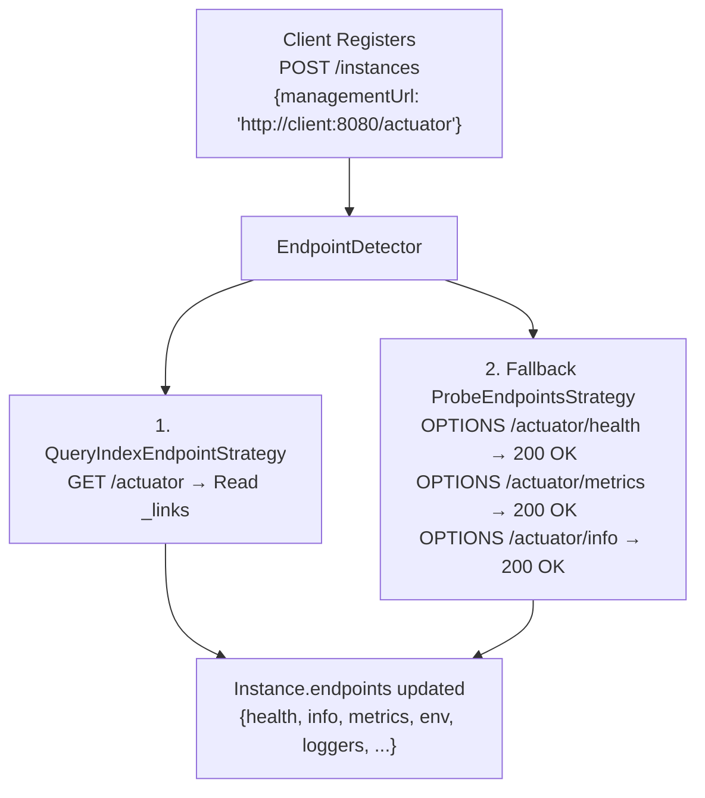

---

sidebar_position: 4
sidebar_custom_props:
  icon: 'wrench'
---

# Custom Endpoint Detection

Customize how Spring Boot Admin Server discovers actuator endpoints from registered instances.

## Overview

When a client registers, the Admin Server detects available actuator endpoints. This detection uses strategies that can
be customized:

1. **QueryIndexEndpointStrategy** (default) - Queries `/actuator` index for links
2. **ProbeEndpointsStrategy** - Probes individual endpoints with OPTIONS requests
3. **ChainingStrategy** - Combines multiple strategies with fallback



---

## Default Behavior

By default, Admin Server uses a **ChainingStrategy** that:

1. First tries **QueryIndexEndpointStrategy** (Spring Boot 2.x+ with `/actuator` index)
2. Falls back to **ProbeEndpointsStrategy** (Spring Boot 1.x or if index query fails)

**AdminServerAutoConfiguration.java**:

```java
@Bean
@ConditionalOnMissingBean
public EndpointDetectionStrategy endpointDetectionStrategy(
        InstanceWebClient instanceWebClient,
        AdminServerProperties adminServerProperties,
        ApiMediaTypeHandler apiMediaTypeHandler) {

    return new ChainingStrategy(
        new QueryIndexEndpointStrategy(instanceWebClient, apiMediaTypeHandler),
        new ProbeEndpointsStrategy(instanceWebClient,
            adminServerProperties.getProbedEndpoints())
    );
}
```

---

## QueryIndexEndpointStrategy

Queries the actuator index at `/actuator` to discover endpoints.

### How It Works

**Request**:

```http
GET /actuator HTTP/1.1
Accept: application/vnd.spring-boot.actuator.v3+json
```

**Response**:

```json
{
  "_links": {
    "self": {
      "href": "http://localhost:8080/actuator",
      "templated": false
    },
    "health": {
      "href": "http://localhost:8080/actuator/health",
      "templated": false
    },
    "info": {
      "href": "http://localhost:8080/actuator/info",
      "templated": false
    },
    "metrics": {
      "href": "http://localhost:8080/actuator/metrics/{requiredMetricName}",
      "templated": true
    }
  }
}
```

**Extracted Endpoints**:

- `health` → `http://localhost:8080/actuator/health`
- `info` → `http://localhost:8080/actuator/info`
- `metrics` is **excluded** (templated)

### Use Only QueryIndexEndpointStrategy

```java
package com.example.admin;

import org.springframework.context.annotation.Bean;
import org.springframework.context.annotation.Configuration;

import de.codecentric.boot.admin.server.services.ApiMediaTypeHandler;
import de.codecentric.boot.admin.server.services.endpoints.EndpointDetectionStrategy;
import de.codecentric.boot.admin.server.services.endpoints.QueryIndexEndpointStrategy;
import de.codecentric.boot.admin.server.web.client.InstanceWebClient;

@Configuration
public class EndpointDetectionConfig {

    @Bean
    public EndpointDetectionStrategy endpointDetectionStrategy(
            InstanceWebClient instanceWebClient,
            ApiMediaTypeHandler apiMediaTypeHandler) {

        return new QueryIndexEndpointStrategy(instanceWebClient, apiMediaTypeHandler);
    }
}
```

**When to use**:

- All clients are Spring Boot 2.x or newer
- `/actuator` index is available on all clients
- Want fastest detection

---

## ProbeEndpointsStrategy

Probes individual endpoints using HTTP OPTIONS requests.

### How It Works

For each endpoint in the probed list:

```http
OPTIONS /actuator/health HTTP/1.1
```

If response is `2xx`, the endpoint is considered available.

### Configuration

**application.yml**:

```yaml
spring:
  boot:
    admin:
      probed-endpoints:
        - health
        - info
        - metrics
        - env
        - loggers
        - logfile
        - threaddump
        - heapdump
```

### Custom Endpoint Paths

If endpoint ID differs from path, use `id:path` syntax:

```yaml
spring:
  boot:
    admin:
      probed-endpoints:
        - health:ping        # Endpoint ID "health" at path "/actuator/ping"
        - metrics:stats      # Endpoint ID "metrics" at path "/actuator/stats"
        - custom:my-custom   # Endpoint ID "custom" at path "/actuator/my-custom"
```

### Use Only ProbeEndpointsStrategy

```java
package com.example.admin;

import org.springframework.context.annotation.Bean;
import org.springframework.context.annotation.Configuration;

import de.codecentric.boot.admin.server.config.AdminServerProperties;
import de.codecentric.boot.admin.server.services.endpoints.EndpointDetectionStrategy;
import de.codecentric.boot.admin.server.services.endpoints.ProbeEndpointsStrategy;
import de.codecentric.boot.admin.server.web.client.InstanceWebClient;

@Configuration
public class EndpointDetectionConfig {

    @Bean
    public EndpointDetectionStrategy endpointDetectionStrategy(
            InstanceWebClient instanceWebClient,
            AdminServerProperties properties) {

        return new ProbeEndpointsStrategy(
            instanceWebClient,
            properties.getProbedEndpoints()
        );
    }
}
```

**When to use**:

- Supporting Spring Boot 1.x applications
- Actuator index is disabled/unavailable
- Need to detect specific custom endpoints

---

## ChainingStrategy

Combines multiple strategies with fallback.

### How It Works

Tries strategies in order until one succeeds:

```java
ChainingStrategy(
    new QueryIndexEndpointStrategy(...),  // Try first
    new ProbeEndpointsStrategy(...)       // Fallback
)
```

If first strategy returns empty, tries next strategy.

### Custom Chaining

```java
package com.example.admin;

import org.springframework.context.annotation.Bean;
import org.springframework.context.annotation.Configuration;

import de.codecentric.boot.admin.server.config.AdminServerProperties;
import de.codecentric.boot.admin.server.services.ApiMediaTypeHandler;
import de.codecentric.boot.admin.server.services.endpoints.ChainingStrategy;
import de.codecentric.boot.admin.server.services.endpoints.EndpointDetectionStrategy;
import de.codecentric.boot.admin.server.services.endpoints.ProbeEndpointsStrategy;
import de.codecentric.boot.admin.server.services.endpoints.QueryIndexEndpointStrategy;
import de.codecentric.boot.admin.server.web.client.InstanceWebClient;

@Configuration
public class EndpointDetectionConfig {

    @Bean
    public EndpointDetectionStrategy endpointDetectionStrategy(
            InstanceWebClient instanceWebClient,
            AdminServerProperties properties,
            ApiMediaTypeHandler apiMediaTypeHandler) {

        return new ChainingStrategy(
            new QueryIndexEndpointStrategy(instanceWebClient, apiMediaTypeHandler),
            new ProbeEndpointsStrategy(instanceWebClient, properties.getProbedEndpoints()),
            new CustomEndpointStrategy()  // Your custom strategy as last resort
        );
    }
}
```

---

## Custom EndpointDetectionStrategy

Implement `EndpointDetectionStrategy` interface for custom detection logic.

### Interface

```java
package de.codecentric.boot.admin.server.services.endpoints;

import reactor.core.publisher.Mono;

import de.codecentric.boot.admin.server.domain.entities.Instance;
import de.codecentric.boot.admin.server.domain.values.Endpoints;

public interface EndpointDetectionStrategy {

    Mono<Endpoints> detectEndpoints(Instance instance);

}
```

### Example: Static Endpoint Strategy

Define endpoints based on metadata:

```java
package com.example.admin;

import reactor.core.publisher.Mono;

import de.codecentric.boot.admin.server.domain.entities.Instance;
import de.codecentric.boot.admin.server.domain.values.Endpoint;
import de.codecentric.boot.admin.server.domain.values.Endpoints;
import de.codecentric.boot.admin.server.services.endpoints.EndpointDetectionStrategy;

public class MetadataEndpointStrategy implements EndpointDetectionStrategy {

    @Override
    public Mono<Endpoints> detectEndpoints(Instance instance) {
        String managementUrl = instance.getRegistration().getManagementUrl();
        if (managementUrl == null) {
            return Mono.empty();
        }

        // Read endpoints from metadata
        String endpointList = instance.getRegistration()
            .getMetadata()
            .get("endpoints");

        if (endpointList == null || endpointList.isBlank()) {
            return Mono.empty();
        }

        // Parse comma-separated endpoint IDs
        List<Endpoint> endpoints = Arrays.stream(endpointList.split(","))
            .map(String::trim)
            .map(id -> Endpoint.of(id, managementUrl + "/" + id))
            .toList();

        return Mono.just(Endpoints.of(endpoints));
    }
}
```

**Client Configuration**:

```yaml
spring:
  boot:
    admin:
      client:
        instance:
          metadata:
            endpoints: health,info,metrics,env
```

**Server Configuration**:

```java
@Bean
public EndpointDetectionStrategy endpointDetectionStrategy() {
    return new ChainingStrategy(
        new MetadataEndpointStrategy(),
        new QueryIndexEndpointStrategy(...)
    );
}
```

### Example: Service-Specific Endpoints

Different endpoint detection based on service name:

```java
package com.example.admin;

import reactor.core.publisher.Mono;

import de.codecentric.boot.admin.server.domain.entities.Instance;
import de.codecentric.boot.admin.server.domain.values.Endpoint;
import de.codecentric.boot.admin.server.domain.values.Endpoints;
import de.codecentric.boot.admin.server.services.endpoints.EndpointDetectionStrategy;

public class ServiceSpecificEndpointStrategy implements EndpointDetectionStrategy {

    private final Map<String, List<String>> serviceEndpoints;

    public ServiceSpecificEndpointStrategy() {
        this.serviceEndpoints = Map.of(
            "payment-service", List.of("health", "info", "metrics", "payments"),
            "user-service", List.of("health", "info", "metrics", "users"),
            "legacy-service", List.of("health", "info")  // Limited endpoints
        );
    }

    @Override
    public Mono<Endpoints> detectEndpoints(Instance instance) {
        String serviceName = instance.getRegistration().getName();
        String managementUrl = instance.getRegistration().getManagementUrl();

        if (managementUrl == null) {
            return Mono.empty();
        }

        List<String> endpointIds = serviceEndpoints.get(serviceName);
        if (endpointIds == null) {
            return Mono.empty();  // Fall back to next strategy
        }

        List<Endpoint> endpoints = endpointIds.stream()
            .map(id -> Endpoint.of(id, managementUrl + "/" + id))
            .toList();

        return Mono.just(Endpoints.of(endpoints));
    }
}
```

### Example: Database-Driven Endpoints

Load endpoint configuration from database:

```java
package com.example.admin;

import java.util.List;

import reactor.core.publisher.Mono;

import de.codecentric.boot.admin.server.domain.entities.Instance;
import de.codecentric.boot.admin.server.domain.values.Endpoint;
import de.codecentric.boot.admin.server.domain.values.Endpoints;
import de.codecentric.boot.admin.server.services.endpoints.EndpointDetectionStrategy;

public class DatabaseEndpointStrategy implements EndpointDetectionStrategy {

    private final EndpointConfigRepository endpointConfigRepository;

    public DatabaseEndpointStrategy(EndpointConfigRepository repository) {
        this.endpointConfigRepository = repository;
    }

    @Override
    public Mono<Endpoints> detectEndpoints(Instance instance) {
        String serviceName = instance.getRegistration().getName();
        String managementUrl = instance.getRegistration().getManagementUrl();

        if (managementUrl == null) {
            return Mono.empty();
        }

        return endpointConfigRepository.findByServiceName(serviceName)
            .map(config -> {
                List<Endpoint> endpoints = config.getEndpointIds().stream()
                    .map(id -> Endpoint.of(id, managementUrl + "/" + id))
                    .toList();
                return Endpoints.of(endpoints);
            })
            .switchIfEmpty(Mono.empty());
    }
}

@Repository
interface EndpointConfigRepository extends ReactiveMongoRepository<EndpointConfig, String> {
    Mono<EndpointConfig> findByServiceName(String serviceName);
}

@Document
class EndpointConfig {
    private String serviceName;
    private List<String> endpointIds;
    // getters/setters
}
```

### Example: HTTP-Based Discovery

Fetch endpoints from custom discovery endpoint:

```java
package com.example.admin;

import reactor.core.publisher.Mono;
import org.springframework.web.reactive.function.client.WebClient;

import de.codecentric.boot.admin.server.domain.entities.Instance;
import de.codecentric.boot.admin.server.domain.values.Endpoint;
import de.codecentric.boot.admin.server.domain.values.Endpoints;
import de.codecentric.boot.admin.server.services.endpoints.EndpointDetectionStrategy;

public class DiscoveryServiceEndpointStrategy implements EndpointDetectionStrategy {

    private final WebClient webClient;

    public DiscoveryServiceEndpointStrategy(WebClient.Builder webClientBuilder) {
        this.webClient = webClientBuilder.baseUrl("http://discovery-service").build();
    }

    @Override
    public Mono<Endpoints> detectEndpoints(Instance instance) {
        String serviceName = instance.getRegistration().getName();
        String managementUrl = instance.getRegistration().getManagementUrl();

        if (managementUrl == null) {
            return Mono.empty();
        }

        return webClient.get()
            .uri("/services/{name}/endpoints", serviceName)
            .retrieve()
            .bodyToFlux(String.class)
            .collectList()
            .map(endpointIds -> {
                List<Endpoint> endpoints = endpointIds.stream()
                    .map(id -> Endpoint.of(id, managementUrl + "/" + id))
                    .toList();
                return Endpoints.of(endpoints);
            })
            .onErrorResume(e -> Mono.empty());
    }
}
```

---

## Endpoint Detection Lifecycle

### When Detection Occurs

Endpoints are detected:

1. **After instance registration** (InstanceRegisteredEvent)
2. **When endpoints are first accessed** (if not yet detected)
3. **Periodically** (can be triggered manually)

### Trigger Manual Detection

```java
@Autowired
private EndpointDetector endpointDetector;

public void refreshEndpoints(InstanceId instanceId) {
    endpointDetector.detectEndpoints(instanceId).subscribe();
}
```

---

## Debugging Endpoint Detection

### Enable Debug Logging

```yaml
logging:
  level:
    de.codecentric.boot.admin.server.services.EndpointDetector: DEBUG
    de.codecentric.boot.admin.server.services.endpoints: DEBUG
```

**Log Output**:

```
DEBUG EndpointDetector - Detect endpoints for Instance{id=abc123}
DEBUG QueryIndexEndpointStrategy - Querying actuator-index for instance abc123 on 'http://client:8080/actuator' successful.
DEBUG EndpointDetector - Detected endpoints: [health, info, metrics, env]
```

### Check Detected Endpoints

**API**:

```bash
curl http://admin-server:8080/instances/{id} | jq '.endpoints'
```

**Response**:

```json
[
  {
    "id": "health",
    "url": "http://localhost:8080/actuator/health"
  },
  {
    "id": "info",
    "url": "http://localhost:8080/actuator/info"
  },
  {
    "id": "metrics",
    "url": "http://localhost:8080/actuator/metrics"
  }
]
```

---

## Advanced Scenarios

### Scenario 1: Legacy Spring Boot 1.x Support

**Configuration**:

```yaml
spring:
  boot:
    admin:
      probed-endpoints:
        # Spring Boot 1.x endpoints
        - health
        - info
        - metrics
        - env
        - trace:httptrace
        - dump:threaddump
```

**Strategy**:

```java
@Bean
public EndpointDetectionStrategy endpointDetectionStrategy(
        InstanceWebClient instanceWebClient,
        AdminServerProperties properties) {

    // Only use probing for legacy apps
    return new ProbeEndpointsStrategy(
        instanceWebClient,
        properties.getProbedEndpoints()
    );
}
```

### Scenario 2: Mixed Spring Boot Versions

**Strategy**:

```java
@Bean
public EndpointDetectionStrategy endpointDetectionStrategy(
        InstanceWebClient instanceWebClient,
        AdminServerProperties properties,
        ApiMediaTypeHandler apiMediaTypeHandler) {

    return new ChainingStrategy(
        // Try modern Spring Boot 2.x+ first
        new QueryIndexEndpointStrategy(instanceWebClient, apiMediaTypeHandler),
        // Fall back to probing for legacy apps
        new ProbeEndpointsStrategy(instanceWebClient, properties.getProbedEndpoints())
    );
}
```

### Scenario 3: Custom Actuator Path

**Client** (custom actuator base path):

```yaml
management:
  endpoints:
    web:
      base-path: /management  # Not /actuator
```

**Server Strategy**:

```java
public class CustomPathEndpointStrategy implements EndpointDetectionStrategy {

    @Override
    public Mono<Endpoints> detectEndpoints(Instance instance) {
        String managementUrl = instance.getRegistration().getManagementUrl();

        // Adjust for custom base path
        if (managementUrl != null && !managementUrl.endsWith("/actuator")) {
            // Query custom index endpoint
            return queryIndex(instance, managementUrl);
        }

        return Mono.empty();
    }
}
```

### Scenario 4: Conditional Detection Based on Metadata

```java
public class ConditionalEndpointStrategy implements EndpointDetectionStrategy {

    private final QueryIndexEndpointStrategy queryStrategy;
    private final ProbeEndpointsStrategy probeStrategy;

    @Override
    public Mono<Endpoints> detectEndpoints(Instance instance) {
        String version = instance.getRegistration()
            .getMetadata()
            .get("spring-boot-version");

        if (version != null && version.startsWith("1.")) {
            // Use probing for Spring Boot 1.x
            return probeStrategy.detectEndpoints(instance);
        } else {
            // Use index query for Spring Boot 2.x+
            return queryStrategy.detectEndpoints(instance);
        }
    }
}
```

---

## Performance Considerations

### QueryIndexEndpointStrategy

**Pros**:

- Single HTTP request
- Fast detection
- Accurate (no false positives)

**Cons**:

- Requires Spring Boot 2.x+
- Requires `/actuator` index enabled

### ProbeEndpointsStrategy

**Pros**:

- Works with any Spring Boot version
- Detects custom endpoints

**Cons**:

- Multiple HTTP requests (one per endpoint)
- Slower detection
- Potential false positives if OPTIONS not supported

### Optimization

Limit probed endpoints to essentials:

```yaml
spring:
  boot:
    admin:
      probed-endpoints:
        - health
        - info
        - metrics
        # Remove rarely-used endpoints
```

---

## Troubleshooting

### Issue: No endpoints detected

**Cause**: Detection strategy failing.

**Debug**:

```yaml
logging:
  level:
    de.codecentric.boot.admin.server.services.endpoints: DEBUG
```

**Check**:

1. `managementUrl` is set
2. Instance is reachable
3. Actuator endpoints are exposed

### Issue: Wrong endpoints detected

**Cause**: Probing detecting endpoints that don't exist.

**Solution**: Use `QueryIndexEndpointStrategy` only:

```java
@Bean
public EndpointDetectionStrategy endpointDetectionStrategy(
        InstanceWebClient instanceWebClient,
        ApiMediaTypeHandler apiMediaTypeHandler) {
    return new QueryIndexEndpointStrategy(instanceWebClient, apiMediaTypeHandler);
}
```

### Issue: Custom endpoints not detected

**Cause**: Custom endpoints not in probed list or not in actuator index.

**Solution**: Add to probed endpoints:

```yaml
spring:
  boot:
    admin:
      probed-endpoints:
        - health
        - info
        - my-custom-endpoint
```

Or create custom strategy.

---

## See Also

- [Server Configuration](../../02-server/01-server.mdx)
- [Spring Boot Actuator Endpoints](https://docs.spring.io/spring-boot/reference/actuator/endpoints.html)

---

## Complete Example

```java
package com.example.admin;

import java.util.Arrays;
import java.util.List;

import org.springframework.context.annotation.Bean;
import org.springframework.context.annotation.Configuration;
import reactor.core.publisher.Mono;

import de.codecentric.boot.admin.server.config.AdminServerProperties;
import de.codecentric.boot.admin.server.domain.entities.Instance;
import de.codecentric.boot.admin.server.domain.values.Endpoint;
import de.codecentric.boot.admin.server.domain.values.Endpoints;
import de.codecentric.boot.admin.server.services.ApiMediaTypeHandler;
import de.codecentric.boot.admin.server.services.endpoints.ChainingStrategy;
import de.codecentric.boot.admin.server.services.endpoints.EndpointDetectionStrategy;
import de.codecentric.boot.admin.server.services.endpoints.ProbeEndpointsStrategy;
import de.codecentric.boot.admin.server.services.endpoints.QueryIndexEndpointStrategy;
import de.codecentric.boot.admin.server.web.client.InstanceWebClient;

@Configuration
public class EndpointDetectionConfig {

    @Bean
    public EndpointDetectionStrategy endpointDetectionStrategy(
            InstanceWebClient instanceWebClient,
            AdminServerProperties properties,
            ApiMediaTypeHandler apiMediaTypeHandler) {

        return new ChainingStrategy(
            // 1. Try metadata-based detection
            new MetadataEndpointStrategy(),
            // 2. Try standard actuator index query
            new QueryIndexEndpointStrategy(instanceWebClient, apiMediaTypeHandler),
            // 3. Fall back to probing
            new ProbeEndpointsStrategy(instanceWebClient, properties.getProbedEndpoints())
        );
    }

    /**
     * Detect endpoints from instance metadata
     */
    static class MetadataEndpointStrategy implements EndpointDetectionStrategy {

        @Override
        public Mono<Endpoints> detectEndpoints(Instance instance) {
            String managementUrl = instance.getRegistration().getManagementUrl();
            if (managementUrl == null) {
                return Mono.empty();
            }

            String endpointList = instance.getRegistration()
                .getMetadata()
                .get("endpoints");

            if (endpointList == null || endpointList.isBlank()) {
                return Mono.empty();
            }

            List<Endpoint> endpoints = Arrays.stream(endpointList.split(","))
                .map(String::trim)
                .map(id -> Endpoint.of(id, managementUrl + "/" + id))
                .toList();

            return Mono.just(Endpoints.of(endpoints));
        }
    }
}
```

**Client Configuration** (optional metadata):

```yaml
spring:
  boot:
    admin:
      client:
        instance:
          metadata:
            endpoints: health,info,metrics,custom
```
