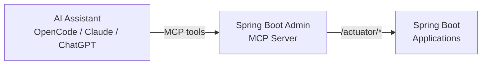

# MCP Integration (experimental)

Spring Boot Admin can act as a **Model Context Protocol (MCP) server**, exposing your registered applications to AI
assistants. This lets you monitor and manage your Spring Boot applications conversationally — without leaving your chat
interface.

```
"What's the heap usage of payment-service?"
"Are there errors in the checkout-service logs?"
"Restart order-service"
"Refresh the configuration for inventory-service"
```

## How It Works



Spring Boot Admin acts as a bridge: the AI assistant calls MCP tools, which Spring Boot Admin translates into actuator
calls against your registered applications. Responses are formatted as plain text for natural display in the chat.

## Available Tools

:::info
Each tool group below corresponds to an actuator endpoint. For a tool to work, two conditions must be met:

1. **The tool must be enabled on the MCP server** — all tool groups are enabled by default and can be toggled via `spring.boot.admin.mcp.tools.<name>=false` (see [Configuration Reference](#configuration-reference)).
2. **The monitored application must expose the corresponding actuator endpoint** — see [Requirements in Monitored Applications](#requirements-in-monitored-applications) for the exact setup needed per tool.
:::

### Registry (no actuator call)

| Tool | Description |
|---|---|
| `list-applications` | Lists all registered applications with their status and management URL |
| `get-status` | Returns the cached status (UP/DOWN/UNKNOWN) for a named application without making an actuator call |

### Beans

| Tool | Description |
|---|---|
| `list-beans` | Lists Spring application context beans with their type and scope; supports an optional name/type filter |

### Caches

| Tool | Description |
|---|---|
| `list-caches` | Lists all caches grouped by `CacheManager` |

### Env

| Tool | Description |
|---|---|
| `get-env` | Resolves a single configuration property or environment variable |
| `list-env` | Lists all environment properties grouped by property source; supports an optional name filter |

### Health

| Tool | Description |
|---|---|
| `get-health` | Fetches full health details including per-component breakdown |

### HTTP Exchanges

| Tool | Description |
|---|---|
| `get-http-exchanges` | Returns recent HTTP exchanges (method, URI, status, duration); supports a limit parameter |

### Logfile

| Tool | Description |
|---|---|
| `get-logs` | Returns the last N lines from the application log file |

### Loggers

| Tool | Description |
|---|---|
| `list-loggers` | Lists all loggers and their effective log levels; supports an optional name filter |
| `get-logger` | Returns the configured and effective log level for a single logger |
| `set-logger-level` | Changes a logger's level at runtime; pass `null` to reset to the inherited level |

### Metrics

| Tool | Description |
|---|---|
| `list-metrics` | Lists all available metric names |
| `get-metrics` | Fetches the current value of a specific metric |

### Restart · Refresh

| Tool | Description |
|---|---|
| `restart-application` | Restarts an application via `/actuator/restart` |
| `refresh-configuration` | Triggers a Spring Cloud config refresh via `/actuator/refresh` |

### Scheduled Tasks

| Tool | Description |
|---|---|
| `get-scheduled-tasks` | Lists all `@Scheduled` tasks with their cron expressions or interval settings |

### Thread Dump

| Tool | Description |
|---|---|
| `get-thread-dump` | Captures a thread dump; useful for diagnosing deadlocks and hung threads |

## Quick Start

### 1. Add the MCP module

The `spring-boot-admin-starter-server-mcp` starter brings in the Spring Boot Admin server together with the MCP server.
It works as a fully functional Spring Boot Admin server on its own — you get the registry and all MCP tools, but
**without the Web UI**:

```xml title="pom.xml"

<dependency>
    <groupId>de.codecentric</groupId>
    <artifactId>spring-boot-admin-starter-server-mcp</artifactId>
</dependency>
```

:::tip Add `spring-boot-admin-starter-server` alongside the MCP starter if you also want the Web UI. Both run on the
same port, giving you the UI and the MCP server side by side.
:::

:::note If you already depend on `spring-boot-admin-starter-server` and only want to add MCP capabilities, you can
instead add the standalone `spring-boot-admin-server-mcp` module:

```xml title="pom.xml"

<dependency>
    <groupId>de.codecentric</groupId>
    <artifactId>spring-boot-admin-server-mcp</artifactId>
</dependency>
```

:::

### 2. Enable MCP in your configuration

```yaml title="application.yml"
spring:
  boot:
    admin:
      mcp:
        enabled: true
```

:::note
`spring.boot.admin.mcp.enabled` defaults to `false`. Existing deployments are unaffected until you opt in.
:::

:::note You don't need to set any `spring.ai.mcp.server.*` properties. Spring Boot Admin automatically contributes
`type=async` and `protocol=streamable` as low-precedence defaults. Both are necessary: Spring AI's `sync` default
would block the reactive event loop, and its SSE transport condition carries `matchIfMissing=true` — meaning when
`protocol` is absent from the environment the legacy SSE transport activates instead of the Streamable HTTP endpoint
at `/mcp`. All values can still be overridden explicitly if needed — for example to report a custom name or
version:

```yaml title="application.yml"
spring:
  ai:
    mcp:
      server:
        name: "My Spring Boot Admin"
        version: "1.0.0"
```

:::

### 3. Connect your AI assistant

Once the server is running, point your AI tool at the MCP endpoint:

```
http://localhost:8080/mcp
```

See the [AI Tool Configuration](#ai-tool-configuration) section below for tool-specific instructions.

## AI Tool Configuration

### OpenCode

Add to your `opencode.json` (global at `~/.config/opencode/opencode.json` or per-project):

```json title="opencode.json"
{
  "$schema": "https://opencode.ai/config.json",
  "mcp": {
    "spring-boot-admin": {
      "type": "remote",
      "url": "http://localhost:8080/mcp",
      "enabled": true
    }
  }
}
```

Verify the connection:

```bash
opencode mcp list
```

You should see `spring-boot-admin connected`. Then ask naturally in any session:

```
list all registered spring boot applications
what is the health of payment-service?
get the last 100 log lines for order-service
restart checkout-service
```

### Claude Desktop

Add to your Claude Desktop configuration file:

- **macOS**: `~/Library/Application Support/Claude/claude_desktop_config.json`
- **Windows**: `%APPDATA%\Claude\claude_desktop_config.json`

```json title="claude_desktop_config.json"
{
  "mcpServers": {
    "spring-boot-admin": {
      "type": "streamableHttp",
      "url": "http://localhost:8080/mcp"
    }
  }
}
```

Restart Claude Desktop after saving. The Spring Boot Admin tools will appear in the tool list.

### Claude Code (claude.ai/code)

Add to your project or global MCP configuration:

```json title=".mcp.json"
{
  "mcpServers": {
    "spring-boot-admin": {
      "type": "streamableHttp",
      "url": "http://localhost:8080/mcp"
    }
  }
}
```

### Cursor

Add to your Cursor MCP settings (`~/.cursor/mcp.json`):

```json title="~/.cursor/mcp.json"
{
  "mcpServers": {
    "spring-boot-admin": {
      "url": "http://localhost:8080/mcp",
      "type": "streamableHttp"
    }
  }
}
```

### Generic MCP Client

Any MCP client that supports **Streamable HTTP** transport can connect:

- **Endpoint**: `POST http://localhost:8080/mcp`
- **Transport**: Streamable HTTP (MCP spec 2025-03-26)
- **Auth**: none by default (see [Security](#security))

## Example Conversations

### Fleet status check

```
You: list all registered applications
Assistant: Registered applications (4):
- payment-service   | status: UP   | management: http://payment:8080/actuator
- order-service     | status: UP   | management: http://order:8080/actuator
- checkout-service  | status: DOWN | management: http://checkout:8080/actuator
- inventory-service | status: UP   | management: http://inventory:8080/actuator
```

### Debugging a failing service

```
You: what is the health of checkout-service?
Assistant: checkout-service health: DOWN
  db: DOWN
  diskSpace: UP

You: get the last 50 log lines for checkout-service
Assistant: Last 50 lines of checkout-service log:
  ...
  ERROR 2026-05-17 09:12:43 - Connection refused: jdbc:postgresql://db:5432/checkout

You: restart checkout-service
Assistant: checkout-service restart initiated successfully.
```

### Metrics investigation

```
You: list metrics for payment-service
Assistant: Available metrics for payment-service (42):
- jvm.memory.used
- jvm.memory.max
- system.cpu.usage
- http.server.requests
...

You: get the jvm.memory.used metric for payment-service
Assistant: payment-service — jvm.memory.used:
  VALUE: 1258291200 bytes
```

### Inspecting configuration

```
You: list the env properties for payment-service filtered by datasource
Assistant: Environment for payment-service (filtered by "datasource"):

[application.yml] (2):
  spring.datasource.url = jdbc:postgresql://db:5432/payment
  spring.datasource.username = payment

You: what is the HELLO env variable for payment-service?
Assistant: payment-service — HELLO:
  value: world
  source: systemEnvironment
```

### Configuration refresh

```
You: refresh the configuration for inventory-service
Assistant: Configuration refreshed for inventory-service. Changed keys: ["app.feature.newFlow","app.cache.ttl"]
```

## Requirements in Monitored Applications

Certain tools require additional setup in the monitored applications:

| Tool                                               | Requirement                                                                                                                                        |
|----------------------------------------------------|----------------------------------------------------------------------------------------------------------------------------------------------------|
| `get-logs`                                         | `logging.file.name` or `logging.file.path` configured; `logfile` actuator endpoint exposed                                                         |
| `get-env` / `list-env`                             | `env` actuator endpoint exposed. Values are masked (`******`) unless `management.endpoint.env.show-values` is set to `ALWAYS` or `WHEN_AUTHORIZED` |
| `restart-application`                              | `management.endpoint.restart.enabled=true`; restart actuator endpoint exposed                                                                      |
| `refresh-configuration`                            | Spring Cloud Context on classpath (`spring-cloud-starter`); `refresh` endpoint exposed                                                             |
| `list-loggers` / `get-logger` / `set-logger-level` | `loggers` actuator endpoint exposed                                                                                                                |
| `get-thread-dump`                                  | `threaddump` actuator endpoint exposed                                                                                                             |
| `get-http-exchanges`                               | `management.httpexchanges.recording.enabled=true`; `httpexchanges` actuator endpoint exposed (Spring Boot 3.x)                                     |
| `get-scheduled-tasks`                              | `scheduledtasks` actuator endpoint exposed                                                                                                         |
| `list-caches`                                      | `caches` actuator endpoint exposed; application must use Spring's cache abstraction                                                                |
| `list-beans`                                       | `beans` actuator endpoint exposed                                                                                                                  |
| All read tools                                     | Actuator endpoints exposed: `management.endpoints.web.exposure.include=*`                                                                          |

```yaml title="application.yml (monitored application)"
management:
  endpoints:
    web:
      exposure:
        include: "*"
  endpoint:
    health:
      show-details: ALWAYS
    restart:
      enabled: true
logging:
  file:
    name: "logs/my-application.log"
```

## Security

By default, MCP endpoints are open. For production deployments, restrict access via Spring Security.

The simplest approach is to use the existing Spring Boot Admin security configuration and extend it to protect `/mcp`:

```java title="SecurityConfiguration.java"

@Bean
@Profile("secure")
public SecurityWebFilterChain securityWebFilterChain(ServerHttpSecurity http) {
	return http
			.authorizeExchange((auth) -> auth
					.pathMatchers("/mcp").authenticated()
					.anyExchange().authenticated())
			.httpBasic(Customizer.withDefaults())
			.csrf(ServerHttpSecurity.CsrfSpec::disable)
			.build();
}
```

Then pass credentials in the MCP client configuration:

```json title="opencode.json"
{
  "mcp": {
    "spring-boot-admin": {
      "type": "remote",
      "url": "http://localhost:8080/mcp",
      "headers": {
        "Authorization": "Basic {env:SBA_BASIC_AUTH}"
      }
    }
  }
}
```

## Configuration Reference

| Property                                      | Default                           | Description                                                                                                                   |
|-----------------------------------------------|-----------------------------------|-------------------------------------------------------------------------------------------------------------------------------|
| `spring.boot.admin.mcp.enabled` | `false` | Enable the MCP server integration |
| `spring.boot.admin.mcp.timeout` | `450ms` | Timeout for actuator calls made by MCP tools |
| `spring.boot.admin.mcp.thread-dump-timeout` | `10s` | Timeout for `/actuator/threaddump` calls, which can be slower than standard endpoints |
| `spring.boot.admin.mcp.tools.applications`    | `true`                            | Register the `list-applications` tool                                                                                         |
| `spring.boot.admin.mcp.tools.health`          | `true`                            | Register the `get-health` and `get-status` tools                                                                              |
| `spring.boot.admin.mcp.tools.metrics`         | `true`                            | Register the `list-metrics` and `get-metrics` tools                                                                           |
| `spring.boot.admin.mcp.tools.env`             | `true`                            | Register the `get-env` and `list-env` tools                                                                                   |
| `spring.boot.admin.mcp.tools.logs`            | `true`                            | Register the `get-logs` tool                                                                                                  |
| `spring.boot.admin.mcp.tools.operations`      | `true`                            | Register the write tools `restart-application` and `refresh-configuration`                                                    |
| `spring.boot.admin.mcp.tools.loggers`         | `true`                            | Register the `list-loggers`, `get-logger`, and `set-logger-level` tools                                                       |
| `spring.boot.admin.mcp.tools.thread-dump`     | `true`                            | Register the `get-thread-dump` tool                                                                                           |
| `spring.boot.admin.mcp.tools.http-exchanges`  | `true`                            | Register the `get-http-exchanges` tool                                                                                        |
| `spring.boot.admin.mcp.tools.scheduled-tasks` | `true`                            | Register the `get-scheduled-tasks` tool                                                                                       |
| `spring.boot.admin.mcp.tools.caches`          | `true`                            | Register the `list-caches` tool                                                                                               |
| `spring.boot.admin.mcp.tools.beans`           | `true`                            | Register the `list-beans` tool                                                                                                |
| `spring.ai.mcp.server.type`                   | `async`                           | Server API type. Spring Boot Admin overrides Spring AI's `sync` default to `async` to match its reactive WebFlux/Netty stack. Override to `sync` only if you have a specific reason. |
| `spring.ai.mcp.server.protocol`               | `streamable`                      | Transport protocol. Spring Boot Admin sets this to `streamable` so the `/mcp` endpoint is active. Without it, Spring AI's SSE transport condition (`matchIfMissing=true`) activates the legacy SSE transport instead. Set to `stateless` for stateless HTTP or `sse` for the legacy SSE transport. |
| `spring.ai.mcp.server.name`                   | `Spring Boot Admin MCP Server`    | Server name reported to MCP clients. Override to report a custom value.                                                       |
| `spring.ai.mcp.server.version`                | current Spring Boot Admin version | Server version reported to MCP clients. Defaults to the running Spring Boot Admin version; override to report a custom value. |

:::note The `spring.boot.admin.mcp.tools.*` flags toggle tool availability **on the Spring Boot Admin server**
a disabled category is never advertised to MCP clients. They are independent of the monitored applications'
`management.endpoint.*.enabled` settings, which are enforced at runtime by each target application (a call to a disabled
endpoint simply returns an error). For example, to run a read-only monitoring deployment, set
`spring.boot.admin.mcp.tools.operations=false`. Changes take effect on server restart.
:::

## Sample Application

A runnable sample combining the Web UI and MCP server is available at
`spring-boot-admin-samples/spring-boot-admin-sample-mcp`. Start it with:

```bash
./mvnw spring-boot:run -pl spring-boot-admin-samples/spring-boot-admin-sample-mcp
```

The Web UI is available at `http://localhost:8080` and the MCP endpoint at `http://localhost:8080/mcp`.
