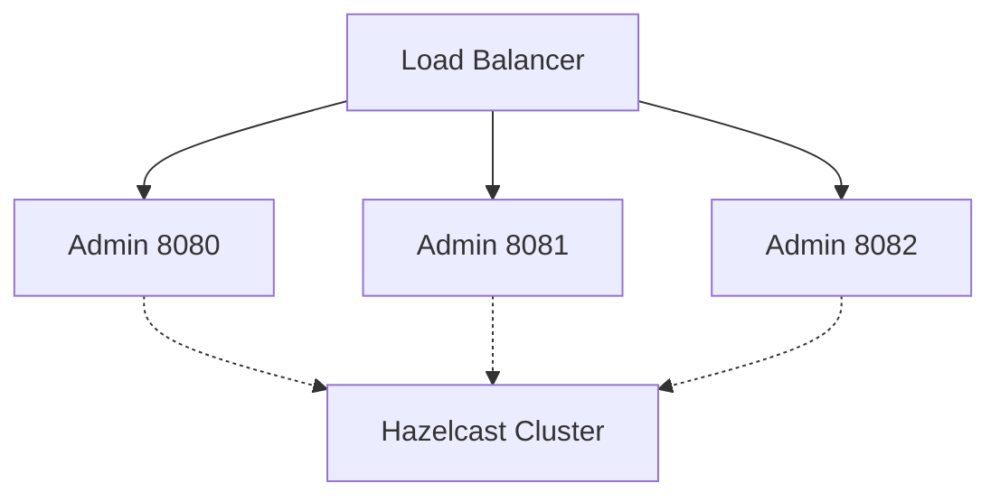

---

sidebar_position: 60
sidebar_custom_props:
  icon: 'file-code'
---

# Hazelcast Sample

Clustered Spring Boot Admin Server deployment using Hazelcast for distributed event storage. This sample demonstrates
high-availability setup where multiple Admin Server instances share state via Hazelcast.

## Overview

**Location**: `spring-boot-admin-samples/spring-boot-admin-sample-hazelcast/`

**Features**:

- Distributed event store with Hazelcast
- Multi-instance clustering
- Shared notification state
- High availability
- TCP/IP cluster discovery
- JMX monitoring enabled

## Prerequisites

- Java 17+, Maven 3.6+

## Running Multiple Instances

### Terminal 1 (Port 8080)

```bash
cd spring-boot-admin-samples/spring-boot-admin-sample-hazelcast
mvn spring-boot:run
```

### Terminal 2 (Port 8081)

```bash
SERVER_PORT=8081 mvn spring-boot:run
```

### Terminal 3 (Port 8082)

```bash
SERVER_PORT=8082 mvn spring-boot:run
```

All instances automatically form a cluster and share:

- Instance events
- Notification state
- Application registry

## Dependencies

```xml
<dependency>
    <groupId>de.codecentric</groupId>
    <artifactId>spring-boot-admin-starter-server</artifactId>
</dependency>
<dependency>
    <groupId>de.codecentric</groupId>
    <artifactId>spring-boot-admin-starter-client</artifactId>
</dependency>
<dependency>
    <groupId>com.hazelcast</groupId>
    <artifactId>hazelcast</artifactId>
</dependency>
```

## Hazelcast Configuration

```java
@Bean
public Config hazelcastConfig() {
    // Event store map - holds all instance events
    MapConfig eventStoreMap = new MapConfig(DEFAULT_NAME_EVENT_STORE_MAP)
        .setInMemoryFormat(InMemoryFormat.OBJECT)
        .setBackupCount(1)  // 1 backup copy
        .setMergePolicyConfig(
            new MergePolicyConfig(PutIfAbsentMergePolicy.class.getName(), 100)
        );

    // Notification map - deduplicates notifications
    MapConfig sentNotificationsMap = new MapConfig(DEFAULT_NAME_SENT_NOTIFICATIONS_MAP)
        .setInMemoryFormat(InMemoryFormat.OBJECT)
        .setBackupCount(1)
        .setEvictionConfig(
            new EvictionConfig()
                .setEvictionPolicy(EvictionPolicy.LRU)
                .setMaxSizePolicy(MaxSizePolicy.PER_NODE)
        );

    Config config = new Config();
    config.addMapConfig(eventStoreMap);
    config.addMapConfig(sentNotificationsMap);
    config.setProperty("hazelcast.jmx", "true");

    // TCP/IP cluster discovery (local)
    config.getNetworkConfig().getJoin().getMulticastConfig().setEnabled(false);
    TcpIpConfig tcpIpConfig = config.getNetworkConfig()
        .getJoin()
        .getTcpIpConfig();
    tcpIpConfig.setEnabled(true);
    tcpIpConfig.setMembers(singletonList("127.0.0.1"));

    return config;
}
```

**Configuration Details**:

- **Event Store**: Reliable storage with 1 backup
- **Sent Notifications**: LRU eviction to prevent memory growth
- **Cluster**: TCP/IP discovery on localhost
- **JMX**: Enabled for monitoring

## How Clustering Works

### Event Synchronization

1. Instance A receives status change event
2. Event stored in Hazelcast distributed map
3. Instances B and C immediately see the event
4. All instances update their local state

### Notification Deduplication

1. Instance A sends notification
2. Records in Hazelcast sent-notifications map
3. Instance B sees event, checks sent-notifications
4. B skips sending (already sent by A)
5. No duplicate notifications to users

### Load Balancing



Users can connect to any instance - they all show the same data.

## Testing Clustering

### Verify Cluster Formation

Check logs for:

```
Members {size:3, ver:3} [
    Member [127.0.0.1]:5701 - e1f2g3h4
    Member [127.0.0.1]:5702 - a5b6c7d8
    Member [127.0.0.1]:5703 - i9j0k1l2
]
```

### Test Event Sharing

1. Register application on instance 8080
2. Check instance 8081 - application appears
3. Stop instance 8080
4. Application still visible on 8081

### Test High Availability

1. Start 3 instances
2. Stop instance 8080
3. Instances 8081 and 8082 continue operating
4. All data preserved (1 backup)

## Production Configuration

### Multicast Discovery

```java
config.getNetworkConfig()
    .getJoin()
    .getMulticastConfig()
    .setEnabled(true)
    .setMulticastGroup("224.2.2.3")
    .setMulticastPort(54327);
```

### TCP/IP with Multiple Hosts

```java
tcpIpConfig.setMembers(Arrays.asList(
    "admin-1.company.com",
    "admin-2.company.com",
    "admin-3.company.com"
));
```

### Kubernetes Discovery

```java
config.getNetworkConfig()
    .getJoin()
    .getKubernetesConfig()
    .setEnabled(true)
    .setProperty("namespace", "default")
    .setProperty("service-name", "spring-boot-admin");
```

## Monitoring Hazelcast

### JMX

Enable JMX and connect with JConsole:

```bash
jconsole
```

Look for `com.hazelcast` MBeans.

### Hazelcast Management Center

```bash
docker run -p 8080:8080 hazelcast/management-center
```

Connect to: `http://localhost:8080`

## Key Takeaways

✅ **High Availability**: No single point of failure  
✅ **Horizontal Scaling**: Add instances dynamically  
✅ **Shared State**: All instances synchronized  
✅ **Enterprise Features**: Backup, eviction, merge policies  

## Next Steps

- [Hazelcast Integration Guide](../04-integration/40-hazelcast.md)
- [Servlet Sample](./10-sample-servlet.md)
- [Custom UI Sample](./70-sample-custom-ui.md)

## See Also

- [Hazelcast Documentation](https://docs.hazelcast.com/)
- [Clustering](../04-integration/40-hazelcast.md)
- [Server Configuration](../02-server/01-server.mdx)
