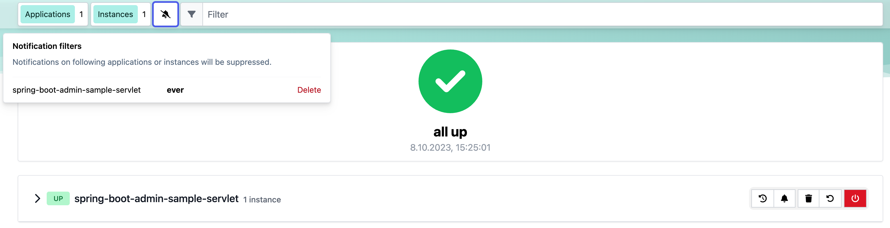

---
sidebar_custom_props:
  icon: 'notifications'
---

## Notification

### Hipchat Notifications

To enable [Hipchat](https://www.hipchat.com/) notifications you need to create an API token on your Hipchat account and set the appropriate configuration properties.

__Hipchat notifications configuration options__
| Property name                                   | Description                                                                                                               | Default value                                                                                                                                                        |
| ----------------------------------------------- | ------------------------------------------------------------------------------------------------------------------------- | -------------------------------------------------------------------------------------------------------------------------------------------------------------------- |
| spring.boot.admin.notify.hipchat.enabled        | Enable Hipchat notifications                                                                                              | true                                                                                                                                                                 |
| spring.boot.admin.notify.hipchat.ignore-changes | Comma-delimited list of status changes to be ignored. Format: "&lt;from-status&gt;:&lt;to-status&gt;". Wildcards allowed. | "UNKNOWN:UP"                                                                                                                                                         |
| spring.boot.admin.notify.hipchat.url            | The HipChat REST API (V2) URL                                                                                             |                                                                                                                                                                      |
| spring.boot.admin.notify.hipchat.auth-token     | The API token with access to the notification room                                                                        |                                                                                                                                                                      |
| spring.boot.admin.notify.hipchat.room-id        | The ID or url-encoded name of the room to send notifications to                                                           |                                                                                                                                                                      |
| spring.boot.admin.notify.hipchat.notify         | Whether the message should trigger a user notification                                                                    | false                                                                                                                                                                |
| spring.boot.admin.notify.hipchat.description    | Description to use in the event. SpEL-expressions are supported                                                           | "&lt;strong&gt;#&#123;instance.registration.name&#125;&lt;/strong&gt;/#&#123;instance.id&#125; is &lt;strong&gt;#&#123;event.statusInfo.status&#125;&lt;/strong&gt;" |

### Slack Notifications

To enable [Slack](https://slack.com/) notifications you need to add an incoming Webhook under custom integrations on your Slack account and configure it appropriately.

__Slack notifications configuration options__
| Property name                                 | Description                                                                                                               | Default value                                                                                                    |
| --------------------------------------------- | ------------------------------------------------------------------------------------------------------------------------- | ---------------------------------------------------------------------------------------------------------------- |
| spring.boot.admin.notify.slack.enabled        | Enable Slack notifications                                                                                                | true                                                                                                             |
| spring.boot.admin.notify.slack.ignore-changes | Comma-delimited list of status changes to be ignored. Format: "&lt;from-status&gt;:&lt;to-status&gt;". Wildcards allowed. | "UNKNOWN:UP"                                                                                                     |
| spring.boot.admin.notify.slack.webhook-url    | The Slack Webhook URL to send notifications to.                                                                           |                                                                                                                  |
| spring.boot.admin.notify.slack.channel        | Optional channel name (without # at the beginning). If different from channel in Slack Webhooks settings                  |                                                                                                                  |
| spring.boot.admin.notify.slack.icon           | Optional icon name (without surrounding colons). If different from icon in Slack Webhooks settings                        |                                                                                                                  |
| spring.boot.admin.notify.slack.username       | Optional username to send notification if different from in Slack Webhooks settings                                       | Spring Boot Admin                                                                                                |
| spring.boot.admin.notify.slack.message        | Message to use in the event. SpEL-expressions and Slack markups are supported                                             | "*#&#123;instance.registration.name&#125;* (#&#123;instance.id&#125;) is *#&#123;event.statusInfo.status&#125;*" |

### Let’s Chat Notifications

To enable [Let’s Chat](https://sdelements.github.io/lets-chat/) notifications you need to add the host url and add the API token and username from Let’s Chat

__Let’s Chat notifications configuration options__
| Property name                                    | Description                                                                                                               | Default value                                                                                                    |
| ------------------------------------------------ | ------------------------------------------------------------------------------------------------------------------------- | ---------------------------------------------------------------------------------------------------------------- |
| spring.boot.admin.notify.letschat.enabled        | Enable let´s Chat notifications                                                                                           | true                                                                                                             |
| spring.boot.admin.notify.letschat.ignore-changes | Comma-delimited list of status changes to be ignored. Format: "&lt;from-status&gt;:&lt;to-status&gt;". Wildcards allowed. | "UNKNOWN:UP"                                                                                                     |
| spring.boot.admin.notify.letschat.url            | The let´s Chat Host URL to send notifications                                                                             |                                                                                                                  |
| spring.boot.admin.notify.letschat.room           | the room where to send the messages                                                                                       |                                                                                                                  |
| spring.boot.admin.notify.letschat.token          | the token to access the let´s Chat API                                                                                    |                                                                                                                  |
| spring.boot.admin.notify.letschat.username       | The username for which the token was created                                                                              | Spring Boot Admin                                                                                                |
| spring.boot.admin.notify.letschat.message        | Message to use in the event. SpEL-expressions are supported                                                               | "*#&#123;instance.registration.name&#125;* (#&#123;instance.id&#125;) is *#&#123;event.statusInfo.status&#125;*" |

### Microsoft Teams Notifications

To enable Microsoft Teams notifications you need to set up a connector webhook url and set the appropriate configuration property.

__Microsoft Teams notifications configuration options__
| Property name                                                  | Description                                                                                                       | Default value                                                                                                                                                |
| -------------------------------------------------------------- | ----------------------------------------------------------------------------------------------------------------- | ------------------------------------------------------------------------------------------------------------------------------------------------------------ |
| spring.boot.admin.notify.ms-teams.enabled                      | Enable Microsoft Teams notifications                                                                              | true                                                                                                                                                         |
| spring.boot.admin.notify.ms-teams.webhook-url                  | The Microsoft Teams webhook url to send the notifications to.                                                     |                                                                                                                                                              |
| spring.boot.admin.notify.ms-teams.deRegisteredTitle            | Title of the Teams message when an app de-registers.                                                              | De-Registered                                                                                                                                                |
| spring.boot.admin.notify.ms-teams.registeredTitle              | Title of the Teams message when an app dregisters.                                                                | Registered                                                                                                                                                   |
| spring.boot.admin.notify.ms-teams.statusChangedTitle           | Title of the Teams message when an app changes status.                                                            | Status Changed                                                                                                                                               |
| spring.boot.admin.notify.ms-teams.messageSummary               | Summary section of every Teams message originating from Spring Boot Admin.                                        | Spring Boot Admin Notification                                                                                                                               |
| spring.boot.admin.notify.ms-teams.theme_color                  | Set the theme color. SpEL-expressions are supported.                                                              | #&#123;event.type == 'STATUS_CHANGED' ? (event.statusInfo.status=='UP' ? '6db33f' : 'b32d36') : '439fe0'&#125;                                               |
| spring.boot.admin.notify.ms-teams.deregister_activity_subtitle | Subtitle of the Activity section of the Teams message when an app de-registers. SpEL-expressions are supported.   | #&#123;instance.registration.name&#125; with id #&#123;instance.id&#125; has de-registered from Spring Boot Admin                                            |
| spring.boot.admin.notify.ms-teams.register_activity_subtitle   | Subtitle of the Activity section of the Teams message when an app registers. SpEL-expressions are supported.      | #&#123;instance.registration.name&#125; with id #&#123;instance.id&#125; has registered with Spring Boot Admin                                               |
| spring.boot.admin.notify.ms-teams.status_activity_subtitle     | Subtitle of the Activity section of the Teams message when an app changes status. SpEL-expressions are supported. | #&#123;instance.registration.name&#125; with id #&#123;instance.id&#125; changed status from #&#123;lastStatus&#125; to #&#123;event.statusInfo.status&#125; |

### Telegram Notifications

To enable [Telegram](https://telegram.org/) notifications you need to create and authorize a telegram bot and set the appropriate configuration properties for auth-token and chat-id.

__Telegram notifications configuration options__
| Property name                                    | Description                                                                                               | Default value                                                                                                                                                        |
| ------------------------------------------------ | --------------------------------------------------------------------------------------------------------- | -------------------------------------------------------------------------------------------------------------------------------------------------------------------- |
| spring.boot.admin.notify.telegram.enabled        | Enable Telegram notifications                                                                             | true                                                                                                                                                                 |
| spring.boot.admin.notify.telegram.auth-token     | The token identifying und authorizing your Telegram bot (e.g. 123456:ABC-DEF1234ghIkl-zyx57W2v1u123ew11). |                                                                                                                                                                      |
| spring.boot.admin.notify.telegram.chat-id        | Unique identifier for the target chat or username of the target channel                                   |                                                                                                                                                                      |
| spring.boot.admin.notify.telegram.disable-notify | If true users will receive a notification with no sound.                                                  | false                                                                                                                                                                |
| spring.boot.admin.notify.telegram.parse_mode     | The parsing mode for the sent message. Currently, `HTML' and 'Markdown' are supported.                    | 'HTML'                                                                                                                                                               |
| spring.boot.admin.notify.telegram.message        | Text to send. SpEL-expressions are supported.                                                             | "&lt;strong&gt;#&#123;instance.registration.name&#125;&lt;/strong&gt;/#&#123;instance.id&#125; is &lt;strong&gt;#&#123;event.statusInfo.status&#125;&lt;/strong&gt;" |

### Webex Notifications

To enable [Webex](https://www.webex.com/) notifications, you need to set the appropriate configuration properties for `auth-token` and `room-id`.

__Webex notifications configuration options__
| Property name                             | Description                                                                                                                          | Default value                                                                                                    |
| ----------------------------------------- | ------------------------------------------------------------------------------------------------------------------------------------ | ---------------------------------------------------------------------------------------------------------------- |
| spring.boot.admin.notify.webex.enabled    | Enable Webex notifications                                                                                                           | true                                                                                                             |
| spring.boot.admin.notify.webex.url        | The Webex server url to send the notifications to.                                                                                   | "https://webexapis.com/v1/messages"                                                                              |
| spring.boot.admin.notify.webex.auth-token | The authentication token for your Webex account (e.g. 123456-ascbhuwbtzzk-abtabhixta-788654).                                        |                                                                                                                  |
| spring.boot.admin.notify.webex.room-id    | Unique identifier for the target room in Webex.                                                                                      |                                                                                                                  |
| spring.boot.admin.notify.webex.message    | Text to send. SpEL-expressions are supported. By default, messages will be sent as Markdown, so you can include Markdown formatting. | "*#&#123;instance.registration.name&#125;* (#&#123;instance.id&#125;) is *#&#123;event.statusInfo.status&#125;*" |

### Discord Notifications

To enable Discord notifications you need to create a webhook and set the appropriate configuration property.

__Discord notifications configuration options__
| Property name                                | Description                                           | Default value                                                                                                    |
| -------------------------------------------- | ----------------------------------------------------- | ---------------------------------------------------------------------------------------------------------------- |
| spring.boot.admin.notify.discord.enabled     | Enable Discord notifications                          | true                                                                                                             |
| spring.boot.admin.notify.discord.webhook-url | The Discord webhook url to send the notifications to. |                                                                                                                  |
| spring.boot.admin.notify.discord.username    | Optional username.                                    | _Default set in Discord_                                                                                         |
| spring.boot.admin.notify.discord.avatar-url  | Optional URL to avatar.                               | _Default set in Discord_                                                                                         |
| spring.boot.admin.notify.discord.tts         | If the message is a text to speech message.           | false                                                                                                            |
| spring.boot.admin.notify.discord.message     | Text to send. SpEL-expressions are supported.         | "*#&#123;instance.registration.name&#125;* (#&#123;instance.id&#125;) is *#&#123;event.statusInfo.status&#125;*" |

### Notification Proxy Settings

All Notifiers which are using a `RestTemplate` can be configured to use a proxy.

__Notification Proxy configuration options__
| Property name                           | Description                                           | Default value |
| --------------------------------------- | ----------------------------------------------------- | ------------- |
| spring.boot.admin.notify.proxy.host     | The proxy host                                        |               |
| spring.boot.admin.notify.proxy.port     | The proxy port                                        |               |
| spring.boot.admin.notify.proxy.username | The proxy username (if proxy requires authentication) |               |
| spring.boot.admin.notify.proxy.password | The proxy password (if proxy requires authentication) |               |

### Notification Reminder

The `RemindingNotifier` sends reminders for down/offline applications, it delegates the sending of notifications to another notifier.

By default, a reminder is triggered when a registered application changes to `DOWN` or `OFFLINE`. You can alter this behaviour via `setReminderStatuses()`. The reminder ends when either the status changes to a non-triggering status or the regarding application gets deregistered.

By default, the reminders are sent every 10 minutes, to change this use `setReminderPeriod()`. The `RemindingNotifier` itself doesn’t start the background thread to send the reminders, you need to take care of this as shown in the given example below;

How to configure reminders

```java title="NotifierConfiguration.java"
@Configuration
public class NotifierConfiguration {
    @Autowired
    private Notifier notifier;

    @Primary
    @Bean(initMethod = "start", destroyMethod = "stop")
    public RemindingNotifier remindingNotifier() {
        RemindingNotifier notifier = new RemindingNotifier(notifier, repository);
        notifier.setReminderPeriod(Duration.ofMinutes(10)); // (1)
        notifier.setCheckReminderInverval(Duration.ofSeconds(10)); //(2)
        return notifier;
    }
}
```

1. The reminders will be sent every 10 minutes.
2. Schedules sending of due reminders every 10 seconds.

### Filtering Notifications

The `FilteringNotifier` allows you to filter certain notification based on rules you can add/remove at runtime. It delegates the sending of notifications to another notifier.

If you add a `FilteringNotifier` to your `ApplicationContext` a RESTful interface on `notifications/filter` gets available. The restful interface provides the following methods for getting, adding, and deleting notification filters:

* `GET notifications/filter`  
   * Returns a list of all registered notification filters. Each containing the attributes `id`, `applicationName`, `expiry`, and `expired`.
* `POST notifications/filters?instanceId=<yourInstanceId>&applicationName=<yourApplicationName>&ttl=<yourInstant>`  
   * Posts a new notification filter for the application/instance of the given `instanceId` or `applicationName`. Either `instanceId` or `applicationName` must be set. The parameter `ttl` is optional and represents the expiration of the filter as an instant (the number of seconds from the epoch of `1970-01-01T00:00:00Z`).
* `DELETE notifications/filters/{id}`  
   * Deletes the notification filter with the requested id from the filters.

You may as well access all notification filter configurations via the main applications view inside SBA client, as seen in the screenshot below.

 

A `FilteringNotifier` might be useful, for instance, if you don’t want to receive notifications when deploying your applications. Before stopping the application, you can add an (expiring) filter via a `POST` request.

How to configure filtering

```java title="NotifierConfig.java"
@Configuration(proxyBeanMethods = false)
public class NotifierConfig {

    private final InstanceRepository repository;

    private final ObjectProvider<List<Notifier>> otherNotifiers;

    public NotifierConfig(InstanceRepository repository, ObjectProvider<List<Notifier>> otherNotifiers) {
        this.repository = repository;
        this.otherNotifiers = otherNotifiers;
    }

    @Bean
    public FilteringNotifier filteringNotifier() { // (1)
        CompositeNotifier delegate = new CompositeNotifier(this.otherNotifiers.getIfAvailable(Collections::emptyList));
        return new FilteringNotifier(delegate, this.repository);
    }

    @Primary
    @Bean(initMethod = "start", destroyMethod = "stop")
    public RemindingNotifier remindingNotifier() { // (2)
        RemindingNotifier notifier = new RemindingNotifier(filteringNotifier(), this.repository);
        notifier.setReminderPeriod(Duration.ofMinutes(10));
        notifier.setCheckReminderInverval(Duration.ofSeconds(10));
        return notifier;
    }

}
```

1. Add the `FilteringNotifier` bean using a delegate (e.g. `MailNotifier` when configured)
2. Add the `RemindingNotifier` as primary bean using the `FilteringNotifier` as delegate.

:::tip
This example combines the reminding and filtering notifiers. This allows you to get notifications after the deployed application hasn’t restarted in a certain amount of time (until the filter expires).
:::

### DingTalk Notifications

To enable [DingTalk](https://www.dingtalk.com/) notifications you need to create and authorize a dingtalk bot and set the appropriate configuration properties for webhookUrl and secret.

__DingTalk notifications configuration options__
| Property name                                 | Description                                            | Default value                                                                                               |
| --------------------------------------------- | ------------------------------------------------------ | ----------------------------------------------------------------------------------------------------------- |
| spring.boot.admin.notify.dingtalk.enabled     | Enable DingTalk notifications.                         | true                                                                                                        |
| spring.boot.admin.notify.dingtalk.webhook-url | The DingTalk webhook url to send the notifications to. |                                                                                                             |
| spring.boot.admin.notify.dingtalk.secret      | The secret to get message sign.                        |                                                                                                             |
| spring.boot.admin.notify.dingtalk.message     | Text to send. SpEL-expressions are supported.          | "#&#123;instance.registration.name&#125; #&#123;instance.id&#125; is #&#123;event.statusInfo.status&#125; " |

### RocketChat Notifications

To enable [Rocket.Chat](https://www.rocket.chat/) notifications you need a personal token access and create a room to send message with this token

__Table 10\. RocketChat notifications configuration options__
| Property name                               | Description                                             | Default value                                                                                                    |
| ------------------------------------------- | ------------------------------------------------------- | ---------------------------------------------------------------------------------------------------------------- |
| spring.boot.admin.notify.rocketchat.enabled | Enable RocketChat notifications.                        | true                                                                                                             |
| spring.boot.admin.notify.rocketchat.url     | The RocketChat server url to send the notifications to. |                                                                                                                  |
| spring.boot.admin.notify.rocketchat.userId  | User id user                                            |                                                                                                                  |
| spring.boot.admin.notify.rocketchat.token   | Generated token user                                    |                                                                                                                  |
| spring.boot.admin.notify.rocketchat.roomId  | The room id to send the message                         |                                                                                                                  |
| spring.boot.admin.notify.rocketchat.message | Text to send. SpEL-expressions are supported.           | "*#&#123;instance.registration.name&#125;* (#&#123;instance.id&#125;) is *#&#123;event.statusInfo.status&#125;*" |
