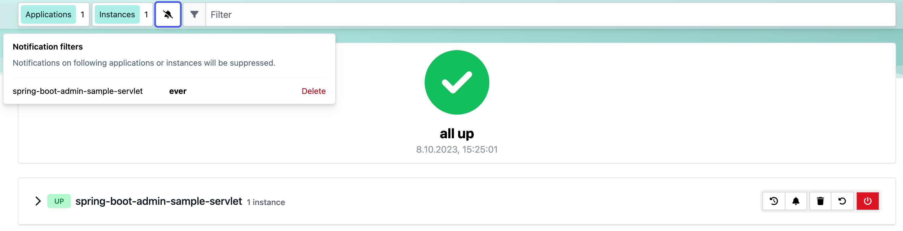

# Notifications

import metadata from "../../../../../../spring-boot-admin-server/target/classes/META-INF/spring-configuration-metadata.json";
import { PropertyTable } from "../../../src/components/PropertyTable";
import DocCardList from '@theme/DocCardList';

You can add your own Notifiers by adding Spring Beans which implement the `Notifier` interface, at best by extending`AbstractEventNotifier` or `AbstractStatusChangeNotifier`.

```java title="CustomNotifier.java"
public class CustomNotifier extends AbstractEventNotifier {

    private static final Logger LOGGER = LoggerFactory.getLogger(CustomNotifier.class);

    public CustomNotifier(InstanceRepository repository) {
        super(repository);
    }

    @Override
    protected Mono<Void> doNotify(InstanceEvent event, Instance instance) {
        return Mono.fromRunnable(() -> {
            if (event instanceof InstanceStatusChangedEvent statusChangedEvent) {
                LOGGER.info("Instance {} ({}) is {}", instance.getRegistration().getName(), event.getInstance(),
                        statusChangedEvent.getStatusInfo().getStatus());
            }
            else {
                LOGGER.info("Instance {} ({}) {}", instance.getRegistration().getName(), event.getInstance(),
                        event.getType());
            }
        });
    }
}
```

## Notification Proxy Settings

All Notifiers which are using a `RestTemplate` can be configured to use a proxy.

<PropertyTable
  title="Notification Proxy configuration options"
  properties={metadata.properties}
  filter={['notify.proxy']}
  exclusive={false}
/>

## Notification Reminder

The `RemindingNotifier` sends reminders for down/offline applications, it delegates the sending of notifications to another notifier.

By default, a reminder is triggered when a registered application changes to `DOWN` or `OFFLINE`. You can alter this behaviour via `setReminderStatuses()`. The reminder ends when either the status changes to a non-triggering status or the regarding application gets deregistered.

By default, the reminders are sent every 10 minutes, to change this use `setReminderPeriod()`. The `RemindingNotifier` itself doesn’t start the background thread to send the reminders, you need to take care of this as shown in the given example below;

How to configure reminders

```java title="NotifierConfiguration.java"
@Configuration
public class NotifierConfiguration {
    @Autowired
    private Notifier notifier;

    @Primary
    @Bean(initMethod = "start", destroyMethod = "stop")
    public RemindingNotifier remindingNotifier() {
        RemindingNotifier notifier = new RemindingNotifier(notifier, repository);
        notifier.setReminderPeriod(Duration.ofMinutes(10)); // (1)
        notifier.setCheckReminderInverval(Duration.ofSeconds(10)); //(2)
        return notifier;
    }
}
```

1. The reminders will be sent every 10 minutes.
2. Schedules sending of due reminders every 10 seconds.

## Filtering Notifications

The `FilteringNotifier` allows you to filter certain notification based on rules you can add/remove at runtime. It delegates the sending of notifications to another notifier.

If you add a `FilteringNotifier` to your `ApplicationContext` a RESTful interface on `notifications/filter` gets available. The restful interface provides the following methods for getting, adding, and deleting notification filters:

* `GET notifications/filter`
 * Returns a list of all registered notification filters. Each containing the attributes `id`, `applicationName`, `expiry`, and `expired`.
* `POST notifications/filters?instanceId=<yourInstanceId>&applicationName=<yourApplicationName>&ttl=<yourInstant>`
 * Posts a new notification filter for the application/instance of the given `instanceId` or `applicationName`. Either `instanceId` or `applicationName` must be set. The parameter `ttl` is optional and represents the expiration of the filter as an instant (the number of seconds from the epoch of `1970-01-01T00:00:00Z`).
* `DELETE notifications/filters/{id}`
 * Deletes the notification filter with the requested id from the filters.

You may as well access all notification filter configurations via the main applications view inside SBA client, as seen in the screenshot below.



A `FilteringNotifier` might be useful, for instance, if you don’t want to receive notifications when deploying your applications. Before stopping the application, you can add an (expiring) filter via a `POST` request.

How to configure filtering

```java title="NotifierConfig.java"
@Configuration(proxyBeanMethods = false)
public class NotifierConfig {

    private final InstanceRepository repository;

    private final ObjectProvider<List<Notifier>> otherNotifiers;

    public NotifierConfig(InstanceRepository repository, ObjectProvider<List<Notifier>> otherNotifiers) {
        this.repository = repository;
        this.otherNotifiers = otherNotifiers;
    }

    @Bean
    public FilteringNotifier filteringNotifier() { // (1)
        CompositeNotifier delegate = new CompositeNotifier(this.otherNotifiers.getIfAvailable(Collections::emptyList));
        return new FilteringNotifier(delegate, this.repository);
    }

    @Primary
    @Bean(initMethod = "start", destroyMethod = "stop")
    public RemindingNotifier remindingNotifier() { // (2)
        RemindingNotifier notifier = new RemindingNotifier(filteringNotifier(), this.repository);
        notifier.setReminderPeriod(Duration.ofMinutes(10));
        notifier.setCheckReminderInverval(Duration.ofSeconds(10));
        return notifier;
    }

}
```

1. Add the `FilteringNotifier` bean using a delegate (e.g. `MailNotifier` when configured)
2. Add the `RemindingNotifier` as primary bean using the `FilteringNotifier` as delegate.

:::tip
This example combines the reminding and filtering notifiers. This allows you to get notifications after the deployed application hasn’t restarted in a certain amount of time (until the filter expires).
:::


## Shipped Notifiers

<DocCardList />

