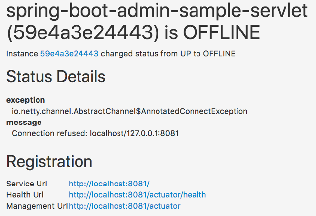

---
sidebar_custom_props:
  icon: 'notifications'
---
import metadata from "../../../../../../spring-boot-admin-server/target/classes/META-INF/spring-configuration-metadata.json";
import { PropertyTable } from "../../../src/components/PropertyTable";

# Mail Notifications

Mail notifications will be delivered as HTML emails rendered using https://www.thymeleaf.org/[Thymeleaf] templates.
To enable Mail notifications, configure a `JavaMailSender` using `spring-boot-starter-mail` and set a recipient.

<figure>
  
  <figcaption>Sample Mail Notification with default template</figcaption>
</figure>

:::info
To prevent disclosure of sensitive information, the default mail template doesn’t show any metadata of the instance. If
you want to you show some of the metadata you can use a custom template.
:::

```xml title="Add spring-boot-starter-mail to your dependencies"

<dependency>
  <groupId>org.springframework.boot</groupId>
  <artifactId>spring-boot-starter-mail</artifactId>
</dependency>
```

```properties title="application.properties"
spring.mail.host=smtp.example.com
spring.boot.admin.notify.mail.to=admin@example.com
```

<PropertyTable
title="Mail notifications configuration options"
properties={metadata.properties}
filter={['notify.mail']}
exclusive={false}
/>
